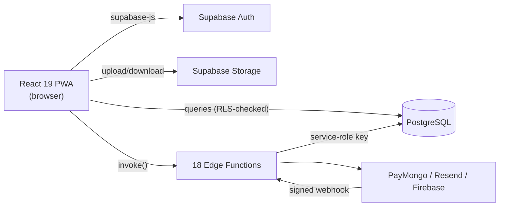
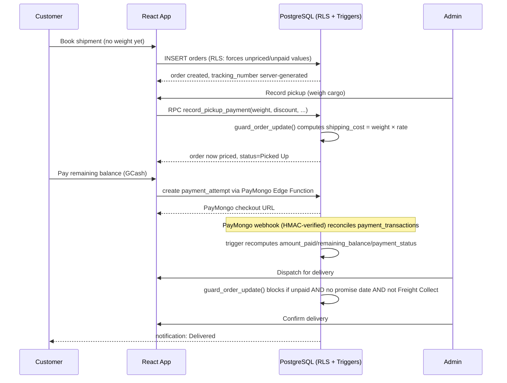

# CargoExpressPH — Compact Defense Reviewer

*(Basahin kasama ang `CARGOEXPRESSPH_COMPLETE_SYSTEM_GUIDE.md` para sa buong detalye. Ito ay ang "cram sheet" bago pumasok sa depensa.)*

---

## 1. One-minute system introduction

"CargoExpressPH ay isang React Progressive Web App na direktang kumokonekta sa Supabase (PostgreSQL + Auth + Storage + Edge Functions) — walang custom Node/Express backend sa gitna. Nagse-serve ito ng cargo booking at tracking para sa isang courier na Manila↔Bohol ang ruta. Dalawang role: customer (nag-boo-book, nag-tra-track, nagbabayad) at admin (nagti-timbang, nagpe-presyo, nagre-record ng payment, nagma-manage ng trips). Ang pinaka-mahalagang prinsipyo: **ang browser ay hindi pinagkakatiwalaan** — ang totoong presyo, payment status, at access control ay ipinapatupad ng database mismo (Row-Level Security, triggers, at SECURITY DEFINER functions), hindi ng React code."

---

## 2. Architecture summary

- **Frontend:** React 19 + Vite, single codebase, role-gated routes (`ProtectedRoute` = UX only, RLS = real security).
- **Data-access layer:** `src/lib/database.js` — 129+ functions, the single funnel most pages go through (one honest exception: `PaymentReturnPage.jsx` does some direct Supabase calls).
- **Backend logic:** lives in Postgres (triggers, CHECK constraints, SECURITY DEFINER RPCs), not in a separate server.
- **Server secrets:** live only in Edge Functions (Deno/TypeScript), never in `VITE_`-prefixed client env vars.
- **External providers:** PayMongo (GCash), Resend (email), Firebase (push + photo-storage fallback).

---

## 3. Technology stack & responsibilities

| Layer | Tech | Responsibility |
|---|---|---|
| UI | React 19.1.0, React Router 7 | Component-based UI, client routing |
| Build | Vite 6.3.0 | Bundling, dev server, service-worker version stamping |
| Client-backend link | @supabase/supabase-js 2.104.1 | Auth, DB queries, storage, realtime, function calls |
| Database | PostgreSQL (via Supabase) | Data storage + business rule enforcement (triggers, RLS, RPCs) |
| Server code | Deno/TypeScript Edge Functions (18) | Payment, email, push, photo-fallback logic needing secrets |
| Payments | PayMongo | GCash checkout, refunds |
| Email | Resend | Announcements, payment reminders, reschedule notices |
| Push/fallback storage | Firebase (FCM + Firestore) | Push notifications, photo storage backup |
| Hosting | Vercel | Static frontend hosting |
| Testing | PGlite, Playwright | DB contract tests (embedded Postgres), browser E2E |

---

## 4. Core business flow (one diagram to rule them all)

---

## 5. Important calculations (memorize these formulas)

| Calculation | Formula |
|---|---|
| **Final charge** | `MAX(0, shipping_cost − discount_amount)` |
| **Outstanding balance** | `finalShippingFee − amount_paid` |
| **Net collected** | `grossCollected − successfulRefunds` |
| **Payment status** | `unpaid` if paid≤0; `paid` if paid ≥ payable−₱0.005; else `partial` |
| **amount_paid / remaining_balance / payment_status** | **Never written by client** — always recomputed by a DB trigger (`update_order_payment_totals`) from the `payment_transactions`/`payment_refunds` ledgers |

**Sabihin sa panel:** "Collections ay hindi profit — walang cost accounting sa reports namin." **Manual/cash refund ay hindi pa implemented** — PayMongo-provider refund lang ang gumagana.

---

## 6. Main security controls

| Control | Threat it stops | Where enforced |
|---|---|---|
| Row-Level Security (RLS) | Isang customer makakabasa ng data ng iba | Postgres policies (57+ across the schema) |
| Value-constrained INSERT policy | Customer nagbo-book na may sariling presyo/paid status | `WITH CHECK` clause sa `orders` INSERT policy |
| `is_admin()` guard sa loob ng RPC | Non-admin tumatawag ng admin-only function | Unang linya ng bawat SECURITY DEFINER admin function |
| Webhook HMAC signature (timing-safe) | Huwad na "payment succeeded" event | `paymongo-webhook` Edge Function |
| Idempotency key + unique constraint | Doble-singil sa payment | RPC-level check + `payment_transactions` unique index |
| Private storage bucket + signed URLs | Sinuman makakabasa ng cargo photos | `cargo-photos` bucket RLS + 1-hour signed URL |
| Per-user booking draft scoping | Customer B makakita ng draft ni Customer A sa parehong device | `sessionStorage` key naka-scope sa `userId` |

---

## 7. Common panel questions (super-condensed — full version sa reviewer/guide)

1. **Bakit hindi security ang React routes?** → RLS at SECURITY DEFINER checks ang totoong hadlang, hindi `ProtectedRoute`.
2. **Ano ang RLS?** → Database-level access control, per row, hindi maiiwasan kahit i-bypass ang frontend.
3. **Paano naiiwasan ang doble-payment?** → Idempotency key + unique constraint sa ledger.
4. **Kailan magiging "priced" ang booking?** → Sa pickup, kapag na-timbang na (`actual_weight > 0`), hindi sa oras ng booking.
5. **Puwede bang mag-deliver na unpaid?** → Oo, kung Freight Collect o may promise date.
6. **Ano ang lumalabas sa Unpaid Shipments?** → Na-timbang na (may totoong presyo) AT may balance pa.
7. **Sino tumatanggap ng reschedule email?** → Depende sa checkbox: booked-only (default) o lahat ng subscribers (bagong option, coordinated para walang doble-email).
8. **May real-time GPS ba?** → Wala — status-based tracking lang, hindi live na lokasyon.
9. **Ano ang PWA?** → Website na may install/offline-shell/push capability — hindi native app.
10. **May manual refund ba?** → Wala pa, proposed lang sa audit docs.

---

## 8. Honest limitations (sabihin nang deretso kung tanungin)

- Manual/cash refund at "charge-correction" — **proposed lang, hindi implemented.**
- Contact inquiry claim/resolve ay may DB-enforced ownership gating, pero **walang resolution-notes field.**
- Walang GPS/real-time location tracking — status-based lang.
- Hindi lahat ng Supabase calls ay dumaan sa `database.js` (`PaymentReturnPage.jsx` may direktang calls) — minor architectural inconsistency.
- Ilang bagay ay hindi na-verify sa research na ito dahil walang live production access: exact deployment status ng pinaka-bagong migration, exact cron schedules, exact session-expiration UX.
- Ang "green" na test suite ay hindi katumbas ng "walang bug" — may naka-record na kaso dati kung saan successful ang `CREATE FUNCTION` pero babagsak pa rin sa totoong execution (F-01 report RPC bug).
