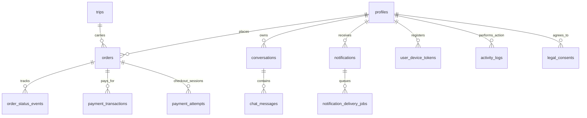

# Database Architecture Review
**CargoExpress PH**

## Executive Summary
This read-only architecture review evaluates the CargoExpress PH database to determine whether its current multi-table design is justified and where simplifications can be made. Following the recent proactive cleanup of over 10 legacy, duplicate, and obsolete tables (including the automated chatbot architecture and email audit logs), the database is currently in an **exceptionally clean and highly optimized state**.

The current 21-table design is strictly necessary and strongly justified. The architecture correctly separates mutable business entities (orders, trips) from immutable historical/financial ledgers (payment_transactions, activity_logs) and asynchronous queues (notification_delivery_jobs). Consolidating these tables further would violate normalization principles, risk financial data integrity, and break the robust background processing capabilities of the system.

## System Understanding
CargoExpress PH is a Progressive Web App (PWA) facilitating sea cargo shipping logistics between Bohol and Manila. 
*   **Core Workflows:** Online booking, trip scheduling, dynamic capacity checking, cargo tracking, and admin operational management.
*   **Tech Stack:** React 19, Vite, Supabase (PostgreSQL, Auth, Storage, Edge Functions), Firebase Cloud Messaging (Push Notifications), PayMongo (Payments), Resend (Emails).
*   **Database Philosophy:** The system leans heavily on PostgreSQL's advanced features—utilizing database triggers for synchronization, strict Foreign Key constraints for integrity, `pg_cron` for health monitoring, and atomic RPCs to safely coordinate edge function workloads.

## Evidence Sources and Inspection Limits
*   **Sources Analyzed:** `supabase/schema.sql`, `supabase/migrations/`, `src/pages/`, `supabase/functions/`, and prior audit history (`CARGOEXPRESS_DATABASE_CLEANUP_AUDIT.md`).
*   **Inspection Limits:** This is a static architectural review based on the repository's configuration. Live Supabase introspection queries (`information_schema`) were bypassed in favor of analyzing the explicit source-of-truth SQL migrations to strictly prevent unintended destructive commands. No row counts or performance profiling were extracted from live production.

## Current Table Inventory
The system maintains 21 active tables, logically grouped as follows:

**1. Core Business Entities**
*   `profiles` (Supabase Auth mirror)
*   `company_information` (Global settings & JSONB coverage map)
*   `trips` (Cargo vessel schedules)
*   `orders` (Shipment records)
*   `conversations` & `chat_messages` (Customer-Admin live support)
*   `contact_inquiries` (Public form submissions)
*   `customer_feedback` (Delivery reviews)

**2. Financial Ledgers**
*   `payment_attempts` (Ephemeral checkout sessions via PayMongo)
*   `payment_transactions` (Immutable, finalized payment receipts)

**3. Notifications & Queues**
*   `user_device_tokens` (FCM targets)
*   `notifications` (In-app user inbox)
*   `notification_delivery_jobs` (Durable queue for edge function push delivery)

**4. Storage Infrastructure**
*   `photo_storage_settings` (Singleton table for Firebase fallback routing)
*   `photo_storage_events` (Health check and upload failure logs)
*   `photo_cleanup_queue` (Garbage collection queue for abandoned storage objects)

**5. Audit Trails & Compliance**
*   `activity_logs` (Admin action trail)
*   `order_status_events` (Shipment tracking timeline)
*   `legal_documents` & `legal_consents` (Versioned TOS/Privacy Policy agreements)

## Current Relationships and Data Flows
The database relies heavily on `profiles(id)` matching `auth.users(id)` as the central hub. Almost all transactional tables cascade from or reference `profiles` (for ownership) and `orders` (for commerce).

## Confirmed Issues and Suspected Issues
*   **Confirmed Issues:** None currently. The recent cleanup phase resolved all standing issues (orphaned chatbot tables and redundant email logs).
*   **Suspected Issues (Performance):** The `company_information` table is loaded on almost every public page to retrieve the JSONB `coverage` map and site details. If not heavily cached on the client, this single-row query could cause unnecessary database hits.

## Table-by-Table Recommendations

| Table Category | Recommendation | Justification |
| :--- | :--- | :--- |
| **Core Entities** (`orders`, `trips`, `profiles`, `company_information`) | **Keep as is** | These are the normalized pillars of the application. They have zero overlap in responsibility. |
| **Financial** (`payment_transactions`, `payment_attempts`) | **Keep as is** | Merging these is highly discouraged. `attempts` tracks temporary webhook states and intent failures. `transactions` must remain a strict, immutable ledger of successful balance changes. |
| **Chat System** (`conversations`, `chat_messages`) | **Keep as is** | Standard 1:N messaging design. Attempting to merge messages into a JSONB array on `conversations` would cause severe lock contention and destroy pagination capabilities. |
| **Audit Logs** (`activity_logs`, `order_status_events`) | **Keep but improve (Retention)** | Logs grow indefinitely. *Improvement:* Introduce a `pg_cron` job to archive or delete `activity_logs` older than 1 year to preserve database space. |
| **Queues** (`notification_delivery_jobs`, `photo_cleanup_queue`) | **Keep as is** | Edge functions require robust state tracking to prevent duplicate executions (fan-out safety). These tables provide the necessary `SKIP LOCKED` distributed queue capabilities. |
| **Compliance** (`legal_documents`, `legal_consents`) | **Keep as is** | Required for strict data privacy compliance (Data Privacy Act of 2012 / GDPR). |

## Edge Functions and Database Logic Assessment

**What CargoExpress gets right:**
*   **Triggers for Syncing:** `handle_new_user()` instantly creates a profile and records legal consent the moment Supabase Auth registers a user. This prevents orphaned Auth accounts flawlessly.
*   **Triggers for Auditing:** `log_order_status_change()` guarantees that tracking timelines update even if an admin modifies an order directly via SQL or Supabase Studio, bypassing the React app.
*   **RPCs for Queueing:** Using `claim_notification_delivery_jobs()` as a Postgres Function allows the database to safely lock rows, ensuring that if multiple Edge Functions run simultaneously, no customer receives the same push notification twice.

**What should remain in Edge Functions:**
*   **External Service Calls:** FCM Push Notification sending and Resend Email delivery correctly live in Edge Functions. The database should never wait on an external network request.

## Proposed Database Structure
*No structural changes proposed.* The database is correctly sized for a production-grade logistics application. 21 tables is a highly efficient footprint given the extensive feature set (payments, push notifications, storage failover, messaging, and compliance).

## Current-to-Proposed Mapping
*   **Current State:** 21 Tables.
*   **Proposed State:** 21 Tables. 
*   **Action Taken:** Previously completed mapping successfully removed 10 redundant tables. The system has reached its optimal relational threshold.

## Security and Data Integrity Findings
1.  **Strict Cascades:** The schema heavily uses `ON DELETE CASCADE` (e.g., deleting a profile deletes their orders and device tokens) and `ON DELETE SET NULL` (deleting an admin keeps the transaction but nullifies the `admin_id`). This is extremely well-implemented and prevents orphaned data.
2.  **RLS Policies:** Standard Row Level Security is active.
3.  **Singleton Pattern Safety:** `photo_storage_settings` and `company_information` safely use `id = TRUE` to enforce a single configuration row.

## Prioritized Action Plan

*   **High-Priority Fixes:** None required. The schema is production-ready.
*   **Useful Simplifications:** None required. Further simplification would require relying on unstructured JSONB columns, degrading query performance.
*   **Optional Improvements:** 
    *   Implement a data retention policy (cron job) to routinely clear `notification_delivery_jobs` that have been `status = 'sent'` for over 30 days to keep the queue table slim.
*   **Changes that should NOT be made:** Do not merge `payment_attempts` with `payment_transactions`. Do not merge `order_status_events` into the `orders` table as a JSON array.

## Migration, Validation, and Rollback Plan
*Not Applicable.* No destructive or structural migrations are recommended as a result of this review. 

## Open Questions
*   **Traffic Scale:** As the business grows, will the single `company_information` table become a bottleneck for public read access? Consider implementing Redis caching or utilizing Edge Caching headers in the React app to reduce database hits for static config.

## Final Recommendation
**Do not modify the current table structure.** The CargoExpress PH database is exceptionally well-architected. It perfectly balances normalization, referential integrity, and distributed queue safety. The recent removal of legacy auditing tables successfully brought the system to its leanest viable state. Focus future engineering efforts on frontend performance and edge caching rather than further database consolidation.
