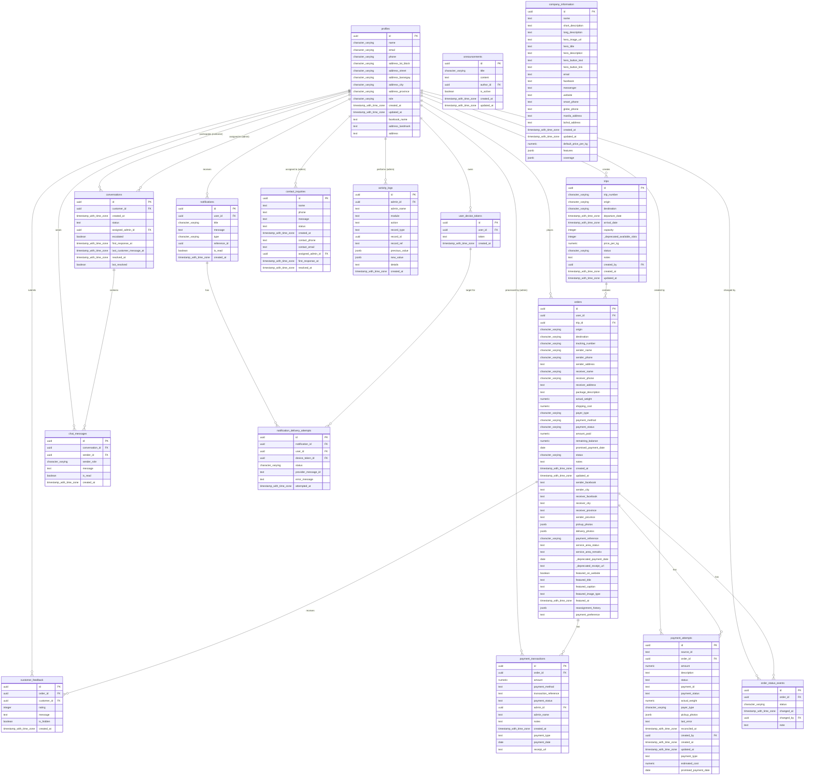

# Database Design

The following tables and schema diagram are derived from the design of the whole system. It states the information that the system uses for processing bookings, trips, users, and transactions.

## Database Schema Diagram

Below is the Entity-Relationship Diagram (ERD) showing how the tables are connected. You can view this diagram visually if you open this file in a Markdown viewer (like GitHub or VS Code), or you can copy this code block into [Mermaid Live Editor](https://mermaid.live/) or draw.io to generate the image.

---

## Database Tables

**Table 1. profiles**: This table contains information about the users, including their personal details, addresses, and system roles.

| Field Name | Data Type | Description |
| :--- | :--- | :--- |
| id | uuid | Unique identifier for each user linked to Supabase authentication. |
| name | character varying | Stores the full name of the user. |
| email | character varying | Stores the unique email address used for logging in. |
| phone | character varying | Stores the primary contact number of the user. |
| address_lot_block | character varying | Stores the specific house, lot, or block details of the user's address. |
| address_street | character varying | Stores the street name of the user's address. |
| address_barangay | character varying | Stores the barangay of the user's address. |
| address_city | character varying | Stores the city or municipality of the user's address. |
| address_province | character varying | Stores the province of the user's address. |
| role | character varying | Indicates the access level of the user such as admin or customer. |
| created_at | timestamp with time zone | Records the date and time when the profile was created. |
| updated_at | timestamp with time zone | Records the date and time when the profile was last updated. |
| facebook_name | text | Stores the Facebook profile name of the user for social contact. |
| address_landmark | text | Stores a notable landmark near the user's address. |
| address | text | Stores the pre-joined full address string for quick display. |

 

**Table 2. trips**: This table contains records of scheduled cargo trips between origins and destinations.

| Field Name | Data Type | Description |
| :--- | :--- | :--- |
| id | uuid | Unique identifier for each cargo trip record. |
| trip_number | character varying | Stores the unique alphanumeric code assigned to the trip. |
| origin | character varying | Indicates the starting location or port of the trip. |
| destination | character varying | Indicates the ending location or port of the trip. |
| departure_date | timestamp with time zone | Records the scheduled date and time of departure. |
| arrival_date | timestamp with time zone | Records the expected or actual date and time of arrival. |
| capacity | integer | Stores the maximum allowable weight capacity for the trip in kilograms. |
| _deprecated_available_slots | integer | Legacy column previously used for tracking available capacity. |
| price_per_kg | numeric | Indicates the cost per kilogram for shipping cargo on this trip. |
| status | character varying | Indicates the current state of the trip such as scheduled or completed. |
| notes | text | Stores additional instructions or remarks regarding the trip. |
| created_by | uuid | Stores the identifier of the admin who created the trip record. |
| created_at | timestamp with time zone | Records the date and time when the trip was created. |
| updated_at | timestamp with time zone | Records the date and time when the trip was last updated. |

 

**Table 3. orders**: This table contains information about individual cargo booking records and their tracking details.

| Field Name | Data Type | Description |
| :--- | :--- | :--- |
| id | uuid | Unique identifier for each booking order. |
| user_id | uuid | Stores the identifier of the customer who placed the order. |
| trip_id | uuid | Stores the identifier of the assigned cargo trip for this order. |
| origin | character varying | Indicates the starting location of the cargo for this order. |
| destination | character varying | Indicates the destination location of the cargo for this order. |
| tracking_number | character varying | Stores the unique tracking code provided to the customer. |
| sender_name | character varying | Stores the full name of the person sending the cargo. |
| sender_phone | character varying | Stores the contact number of the sender. |
| sender_address | text | Stores the complete address of the sender. |
| receiver_name | character varying | Stores the full name of the person receiving the cargo. |
| receiver_phone | character varying | Stores the contact number of the receiver. |
| receiver_address | text | Stores the complete address of the receiver. |
| package_description | text | Stores the details and description of the items being shipped. |
| actual_weight | numeric | Records the verified weight of the package in kilograms. |
| shipping_cost | numeric | Records the calculated total cost for shipping the cargo. |
| payer_type | character varying | Indicates whether the sender or receiver is paying for the shipment. |
| payment_method | character varying | Indicates the chosen mode of payment such as cash or gcash. |
| payment_status | character varying | Indicates the current payment state of the order such as paid or unpaid. |
| amount_paid | numeric | Records the total amount already paid by the customer. |
| remaining_balance | numeric | Records the outstanding amount left to be paid. |
| promised_payment_date | date | Records the date when the customer promised to settle the balance. |
| status | character varying | Indicates the current tracking status of the order such as Pending or In Transit. |
| notes | text | Stores additional administrative notes about the order. |
| created_at | timestamp with time zone | Records the date and time when the order was placed. |
| updated_at | timestamp with time zone | Records the date and time when the order was last updated. |
| sender_facebook | text | Stores the Facebook profile name of the sender. |
| sender_city | text | Stores the city of the sender. |
| receiver_facebook | text | Stores the Facebook profile name of the receiver. |
| receiver_city | text | Stores the city of the receiver. |
| receiver_province | text | Stores the province of the receiver. |
| sender_province | text | Stores the province of the sender. |
| pickup_photos | jsonb | Stores a collection of photo URLs taken during pickup. |
| delivery_photos | jsonb | Stores a collection of photo URLs taken during delivery. |
| payment_reference | character varying | Stores the reference number for the payment transaction. |
| service_area_status | text | Indicates if the delivery address is within the standard service area. |
| service_area_remarks | text | Stores notes regarding the review of the service area. |
| _deprecated_payment_date | date | Legacy column previously used to store payment dates. |
| _deprecated_receipt_url | text | Legacy column previously used to store payment receipt links. |
| featured_on_website | boolean | Indicates if this order is showcased as a featured delivery on the website. |
| featured_title | text | Stores the title used when featuring this order. |
| featured_caption | text | Stores the caption used when featuring this order. |
| featured_image_type | text | Indicates the type of image used for featuring the order. |
| featured_at | timestamp with time zone | Records the date and time when the order was featured. |
| reassignment_history | jsonb | Stores a log of the different trips this order was assigned to. |
| payment_preference | text | Stores the user's preferred payment method for the transaction. |

 

**Table 4. announcements**: This table stores system announcements published by admins.

| Field Name | Data Type | Description |
| :--- | :--- | :--- |
| id | uuid | Unique identifier for each announcement record. |
| title | character varying | Stores the headline or title of the announcement. |
| content | text | Stores the full body text of the announcement. |
| author_id | uuid | Stores the identifier of the admin who created the announcement. |
| is_active | boolean | Indicates whether the announcement is currently visible to users. |
| created_at | timestamp with time zone | Records the date and time when the announcement was created. |
| updated_at | timestamp with time zone | Records the date and time when the announcement was last updated. |

 

**Table 5. notifications**: This table manages automated alerts and notifications sent to users.

| Field Name | Data Type | Description |
| :--- | :--- | :--- |
| id | uuid | Unique identifier for each notification record. |
| user_id | uuid | Stores the identifier of the user receiving the notification. |
| title | character varying | Stores the title or subject of the notification. |
| message | text | Stores the main content of the notification message. |
| type | character varying | Indicates the category of the notification such as order updates or general alerts. |
| reference_id | uuid | Stores the identifier of the related record like an order or trip ID. |
| is_read | boolean | Indicates whether the user has already opened or read the notification. |
| created_at | timestamp with time zone | Records the date and time when the notification was created. |

 

**Table 6. contact_inquiries**: This table records messages sent by visitors through the public contact form.

| Field Name | Data Type | Description |
| :--- | :--- | :--- |
| id | uuid | Unique identifier for each contact inquiry. |
| name | text | Stores the name of the person submitting the inquiry. |
| phone | text | Stores the primary phone number provided by the visitor. |
| message | text | Stores the actual question or concern of the visitor. |
| status | text | Indicates the current state of the inquiry such as new or resolved. |
| created_at | timestamp with time zone | Records the date and time when the inquiry was received. |
| contact_phone | text | Stores an alternative contact phone number for the inquiry. |
| contact_email | text | Stores the email address provided by the visitor. |
| assigned_admin_id | uuid | Stores the identifier of the admin assigned to handle the inquiry. |
| first_response_at | timestamp with time zone | Records the date and time when an admin first replied. |
| resolved_at | timestamp with time zone | Records the date and time when the inquiry was marked as resolved. |

 

**Table 7. conversations**: This table manages the support chat threads between customers and the system.

| Field Name | Data Type | Description |
| :--- | :--- | :--- |
| id | uuid | Unique identifier for each conversation thread. |
| customer_id | uuid | Stores the identifier of the customer who owns the conversation. |
| created_at | timestamp with time zone | Records the date and time when the conversation started. |
| status | text | Indicates the current state of the chat determining whose turn it is to reply. |
| assigned_admin_id | uuid | Stores the identifier of the admin handling the conversation. |
| escalated | boolean | Indicates whether the conversation requires urgent human attention. |
| first_response_at | timestamp with time zone | Records the date and time when the first admin response was sent. |
| last_customer_message_at | timestamp with time zone | Records the date and time of the last message sent by the customer. |
| resolved_at | timestamp with time zone | Records the date and time when the conversation was concluded. |
| bot_resolved | boolean | Indicates whether the automated bot successfully resolved the issue. |

 

**Table 8. chat_messages**: This table stores the individual messages sent within a support conversation.

| Field Name | Data Type | Description |
| :--- | :--- | :--- |
| id | uuid | Unique identifier for each individual chat message. |
| conversation_id | uuid | Stores the identifier of the conversation this message belongs to. |
| sender_id | uuid | Stores the identifier of the user who sent the message. |
| sender_role | character varying | Indicates the role of the sender such as admin or customer. |
| message | text | Stores the actual text content of the message. |
| is_read | boolean | Indicates whether the message has been read by the recipient. |
| created_at | timestamp with time zone | Records the date and time when the message was sent. |

 

**Table 9. payment_attempts**: This table tracks individual attempts made through payment gateways.

| Field Name | Data Type | Description |
| :--- | :--- | :--- |
| id | uuid | Unique identifier for each payment attempt record. |
| source_id | text | Stores a unique reference from the payment provider. |
| order_id | uuid | Stores the identifier of the associated order being paid for. |
| amount | numeric | Records the monetary value attempted in this transaction. |
| description | text | Stores a brief description of what the payment covers. |
| status | text | Indicates the outcome of the payment attempt such as pending or failed. |
| payment_id | text | Stores the unique identifier returned by the payment gateway. |
| payment_status | text | Records the detailed status directly from the payment provider. |
| actual_weight | numeric | Records the weight of the package at the time of payment processing. |
| payer_type | character varying | Indicates whether the sender or receiver initiated the payment attempt. |
| pickup_photos | jsonb | Stores a collection of photo URLs related to the payment attempt. |
| last_error | text | Records the error message if the payment attempt failed. |
| reconciled_at | timestamp with time zone | Records the date and time when the payment was matched with internal records. |
| created_by | uuid | Stores the identifier of the user who initiated the payment attempt. |
| created_at | timestamp with time zone | Records the date and time when the payment attempt was created. |
| updated_at | timestamp with time zone | Records the date and time when the payment attempt was last updated. |
| payment_type | text | Indicates whether the attempt is for full payment or pay-later. |
| estimated_cost | numeric | Records the projected cost of the shipment during the attempt. |
| promised_payment_date | date | Records the date the customer promised to pay if using a deferred option. |

 

**Table 10. activity_logs**: This table tracks the actions performed by admins for system auditing.

| Field Name | Data Type | Description |
| :--- | :--- | :--- |
| id | uuid | Unique identifier for each activity log entry. |
| admin_id | uuid | Stores the identifier of the admin who performed the action. |
| admin_name | text | Stores the name of the admin for quick reference. |
| module | text | Indicates the system module where the action occurred. |
| action | text | Stores a description of the specific action performed by the admin. |
| record_type | text | Indicates the type of data record that was modified. |
| record_id | uuid | Stores the identifier of the specific record that was modified. |
| record_ref | text | Stores a human-readable reference or title for the modified record. |
| previous_value | jsonb | Records the state of the data before the modification in JSON format. |
| new_value | jsonb | Records the state of the data after the modification in JSON format. |
| details | text | Stores additional context or notes regarding the activity. |
| created_at | timestamp with time zone | Records the date and time when the action was logged. |

 

**Table 11. payment_transactions**: This table logs all finalized payment records and partial payments made for orders.

| Field Name | Data Type | Description |
| :--- | :--- | :--- |
| id | uuid | Unique identifier for each payment transaction record. |
| order_id | uuid | Stores the identifier of the associated order being paid for. |
| amount | numeric | Records the exact monetary value paid in this transaction. |
| payment_method | text | Indicates the method used for this specific payment. |
| transaction_reference | text | Stores the reference number provided by the payment gateway or bank. |
| payment_status | text | Indicates the status of this specific transaction. |
| admin_id | uuid | Stores the identifier of the admin who processed or verified the payment. |
| admin_name | text | Stores the name of the processing admin for quick reference. |
| notes | text | Stores additional remarks regarding the payment transaction. |
| created_at | timestamp with time zone | Records the date and time when the transaction was recorded in the system. |
| payment_type | text | Indicates the nature of the transaction such as an additional payment. |
| payment_date | date | Records the actual date when the payment was made. |
| receipt_url | text | Stores the link to the uploaded proof of payment image. |

 

**Table 12. company_information**: This table stores the configurable global details and settings of the company.

| Field Name | Data Type | Description |
| :--- | :--- | :--- |
| id | uuid | Unique identifier for the single company information record. |
| name | text | Stores the display name of the company. |
| short_description | text | Stores a brief description or tagline of the company. |
| long_description | text | Stores the comprehensive background information about the company. |
| hero_image_url | text | Stores the link to the main banner image used on the website homepage. |
| hero_title | text | Stores the primary headline displayed on the homepage banner. |
| hero_description | text | Stores the subtext or supporting description on the homepage banner. |
| hero_button_text | text | Stores the label used for the primary call-to-action button. |
| hero_button_link | text | Stores the destination URL for the primary call-to-action button. |
| email | text | Stores the official contact email address of the company. |
| facebook | text | Stores the link to the company's official Facebook page. |
| messenger | text | Stores the link to the company's official Messenger chat. |
| website | text | Stores the official website URL of the company. |
| smart_phone | text | Stores the company's primary Smart contact number. |
| globe_phone | text | Stores the company's primary Globe contact number. |
| manila_address | text | Stores the physical address of the Manila warehouse or office. |
| bohol_address | text | Stores the physical address of the Bohol warehouse or office. |
| created_at | timestamp with time zone | Records the date and time when the company profile was created. |
| updated_at | timestamp with time zone | Records the date and time when the company details were last updated. |
| default_price_per_kg | numeric | Records the default pricing rate applied to cargo shipments. |
| features | jsonb | Stores a JSON list of featured services or highlights offered by the company. |
| coverage | jsonb | Stores a JSON list of supported regions and municipalities for delivery. |

 

**Table 13. customer_feedback**: This table stores the ratings and reviews submitted by customers after a delivery.

| Field Name | Data Type | Description |
| :--- | :--- | :--- |
| id | uuid | Unique identifier for each feedback entry. |
| order_id | uuid | Stores the identifier of the delivered order being reviewed. |
| customer_id | uuid | Stores the identifier of the customer providing the feedback. |
| rating | integer | Records the star rating given by the customer from 1 to 5. |
| message | text | Stores the written review or comment provided by the customer. |
| is_hidden | boolean | Indicates if the feedback is hidden from public view by an admin. |
| created_at | timestamp with time zone | Records the date and time when the feedback was submitted. |

 

**Table 14. user_device_tokens**: This table manages the push notification tokens for user devices.

| Field Name | Data Type | Description |
| :--- | :--- | :--- |
| id | uuid | Unique identifier for each registered device token. |
| user_id | uuid | Stores the identifier of the user who owns the device. |
| token | text | Stores the unique push notification token assigned to the device. |
| created_at | timestamp with time zone | Records the date and time when the device token was registered. |

 

**Table 15. notification_delivery_attempts**: This table tracks whether push notifications successfully reached devices.

| Field Name | Data Type | Description |
| :--- | :--- | :--- |
| id | uuid | Unique identifier for each delivery attempt record. |
| notification_id | uuid | Stores the identifier of the notification being sent. |
| user_id | uuid | Stores the identifier of the user receiving the notification. |
| device_token_id | uuid | Stores the identifier of the specific device targeted for delivery. |
| status | character varying | Indicates the outcome of the delivery attempt such as sent or failed. |
| provider_message_id | text | Stores the reference ID returned by the push notification provider. |
| error_message | text | Records the reason if the notification delivery failed. |
| attempted_at | timestamp with time zone | Records the date and time when the delivery was attempted. |

 

**Table 16. order_status_events**: This table provides a timeline log of all status changes for an order.

| Field Name | Data Type | Description |
| :--- | :--- | :--- |
| id | uuid | Unique identifier for each status change event. |
| order_id | uuid | Stores the identifier of the order whose status was changed. |
| status | character varying | Records the new status that was applied to the order. |
| changed_at | timestamp with time zone | Records the date and time when the status change occurred. |
| changed_by | uuid | Stores the identifier of the user or admin who changed the status. |
| note | text | Stores additional remarks explaining why the status was changed. |
