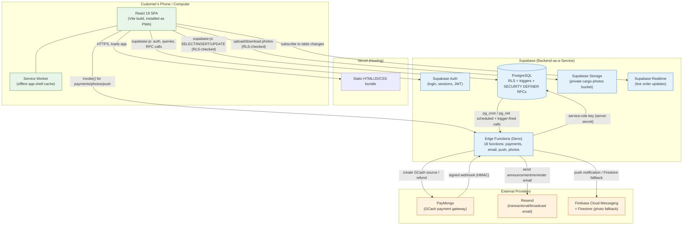
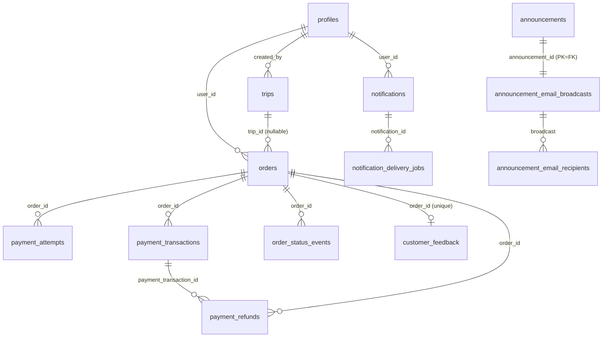

# CargoExpressPH — Complete System Guide (Thesis Defense Study Material)

**Paalala bago magsimula:** Ito ay isang READ-ONLY na dokumentasyon. Walang code, database, o deployment ang binago para gawin ito. Lahat ng nakasulat dito ay galing sa aktwal na binasa naming source code — hindi sa dating audit, hindi sa lumang thesis docs. Kung may nakita kaming hindi tugma sa dati mong akala, sasabihin namin nang diretso, hindi kami mag-iimbento ng paliwanag para lang "consistent."

**Paano gamitin ang guide na ito:** Bawat seksyon ay may (1) simpleng paliwanag muna, (2) halimbawa, (3) technical detail, (4) code reference. May "Dapat mong tandaan" at 3 self-check questions sa dulo ng bawat malaking seksyon. May glossary sa dulo ng buong dokumento.

**Legend ng evidence level** na gagamitin sa buong guide:
- ✅ **Implemented & confirmed in code** — nabasa namin mismo ang source, hindi lang assumption.
- 🟡 **Implemented locally, deployment unverified** — nasa code pero hindi namin na-check kung live na sa production (walang live access sa research pass na ito).
- 🔵 **Proposed / on hold / not implemented** — may plano lang, wala pang code.
- ⚪ **Unknown / hindi na-verify** — hindi namin nakumpirma dahil sa oras o access.

---

## Table of Contents

1. [Big Picture](#1-big-picture)
2. [Languages and Technologies](#2-languages-and-technologies)
3. [Architecture and Design Patterns](#3-architecture-and-design-patterns)
4. [Every Module and Page](#4-every-module-and-page)
5. [Complete Workflows](#5-complete-workflows)
6. [Business Rules, Precisely](#6-business-rules-precisely)
7. [The Database](#7-the-database)
8. [Calculations with Worked Examples](#8-calculations-with-worked-examples)
9. [The Security Model](#9-the-security-model)
10. [Failure Recovery and Reliability](#10-failure-recovery-and-reliability)
11. [Deployment and Testing](#11-deployment-and-testing)
12. [Defense Questions and Answers](#12-defense-questions-and-answers)
13. [Glossary](#13-glossary)
14. [Final Notes: Study Plan, Misunderstandings, Mismatches, Unverified Items](#14-final-notes)

---

## 1. Big Picture

### 1.1 One-minute explanation (sabihin mo ito sa defense)

"CargoExpressPH ay isang web-based na cargo booking and tracking system para sa isang courier na nagpapadala ng cargo sa pagitan ng Manila at Bohol. Ang customer ay pwedeng mag-book ng padala, i-track ito, at magbayad online. Ang admin naman ang nagma-manage ng mga trips (biyahe), nagti-timbang at nagpe-presyo ng padala sa pickup, at nagre-record ng payments. Ang buong sistema ay ginawa sa React para sa frontend, at Supabase — isang Postgres database na may built-in authentication, storage, at serverless functions — para sa backend. Ang pinakamahalagang prinsipyo ng system: **hindi pinagkakatiwalaan ang browser.** Kahit anong sabihin ng frontend, ang totoong pricing, totoong payment status, at totoong access control ay sinisiguro ng database mismo — hindi ng JavaScript code sa React."

### 1.2 Deeper explanation

CargoExpressPH ay hindi lang isang "form na nagse-save sa database." Ito ay isang **Progressive Web App (PWA)** — isang website na pwedeng i-install sa phone o computer parang normal na app, may sarili itong icon, at may partial offline capability (mabubuksan ang app shell kahit walang internet, pero hindi makakapag-book o makapag-bayad nang walang connection dahil lahat ng totoong data ay nasa server).

Dalawang klase ng user: **customer** (nagbo-book at nagta-track) at **admin** (nagma-manage ng operations). Parehong role ay iisang codebase lang, magkaiba lang ang mga pages/routes na makikita nila (`/customer/...` vs `/admin/...`), at ang totoong pagkakaiba sa access ay ipinapatupad sa **database** (Row-Level Security / RLS), hindi lang sa "kung anong button ang nakikita mo."

Ang React app mismo ay **hindi** kumokonekta sa isang custom Node.js/Express server. Direkta itong kumokonekta sa Supabase gamit ang `@supabase/supabase-js` client library — parang direktang "talking" sa database at sa authentication system, pero naka-guard ng RLS policies kaya kahit alam ng customer ang structure ng database, hindi sila makaka-access ng data na hindi kanila.

May mga bahagi rin ng system na tumatakbo bilang **Supabase Edge Functions** — maliliit na server-side na TypeScript/Deno programs na tumatakbo lang kapag kailangan (parang "serverless"), ginagamit para sa mga bagay na dapat lihim (payment provider secrets, email sending, push notifications) na hindi dapat malaman ng browser.

### 1.3 Mermaid architecture diagram



### 1.4 Sino gumagamit, ano ang magagawa nila

| Role | Ano ang pwede | Halimbawa ng page |
|---|---|---|
| **Guest (walang account)** | Public tracking, tingnan ang company info/schedules, mag-submit ng inquiry | `/track`, `/about`, `/schedules` |
| **Customer** | Mag-book, mag-track, magbayad, tumanggap ng notification, mag-feedback, mag-chat sa support | `/customer/*` |
| **Admin** | Mag-manage ng trips, mag-timbang at mag-presyo, mag-record ng payment, mag-refund, mag-broadcast ng announcement, tumingin ng reports | `/admin/*` |

### 1.5 Ano ang tumatakbo saan

| Tumatakbo sa **browser ng customer/admin** | Tumatakbo sa **Supabase server** |
|---|---|
| React components, form validation (UX lang, hindi security), booking draft (sessionStorage), service worker cache, client-side status.js "hints" | Auth verification, RLS policies, lahat ng pricing/discount calculation, payment ledger, trigger-based status cascades, email/push sending, refund reconciliation |

**Kailangan ng internet:** login, booking, tracking, payment, lahat ng may kinalaman sa totoong data (kasi `/rest/v1/`, `/auth/v1/`, `/storage/v1/`, `/functions/v1/` calls ay **network-first**, walang offline cache — ✅ confirmed sa `public/sw.js`).

**Pwede offline:** ang app shell mismo (HTML/CSS/JS na na-download na, mga icon, previously-viewed images) — para hindi blangko ang screen kapag nawalan ng signal saglit, pero hindi ito magagamit para mag-book o mag-bayad.

### Dapat mong tandaan
- CargoExpressPH ay isang **React PWA** na direktang kumokonekta sa **Supabase** (Postgres + Auth + Storage + Edge Functions) — walang custom Express/Node backend.
- Ang **database ang tunay na security boundary**, hindi ang React routes. Ito ang paulit-ulit na sinasabi sa buong codebase (CLAUDE.md, README, at nakumpirma namin sa totoong RLS policies).
- May offline app-shell cache, pero lahat ng totoong data operations ay kailangan ng internet.

### Self-check
1. **Q: Bakit hindi puwedeng umasa lang sa `ProtectedRoute` sa React para sa security?**
   A: Dahil `ProtectedRoute` ay UX convenience lang — kung tatawagan mo mismo ang Supabase RPC/table nang diretso (halimbawa gamit ang browser dev tools), hindi ka titigil ng `ProtectedRoute`. Ang totoong hadlang ay ang RLS policy at ang `is_admin()` check sa loob ng bawat SECURITY DEFINER function.
2. **Q: Ano ang mangyayari kung mawalan ng internet ang isang admin habang tinitignan niya ang order list?**
   A: Makikita pa rin niya ang app shell (walang blangkong screen), pero ang mismong data (orders) ay hindi na-cache — magbabalik ito ng offline error o lumang laman hangga't hindi bumalik ang koneksyon.
3. **Q: Bakit tinawag itong "PWA" imbes na "responsive website" lang?**
   A: Dahil may service worker (`public/sw.js`) na nag-cache ng app shell, may `manifest.json` na nagpapahintulot i-install ito parang app (may icon, standalone display mode), at may push notification support — mga features na wala sa ordinaryong responsive website.

---

## 2. Languages and Technologies

### 2.1 Full technology table

| Technology | Category | Responsibility | Actual usage in this project | Example |
|---|---|---|---|---|
| **JavaScript (ES2020+, JSX)** | Programming language | Lahat ng frontend logic | 100% ng `src/` ay `.js`/`.jsx`, walang TypeScript sa frontend | `src/lib/database.js` |
| **TypeScript** | Programming language (typed superset ng JS) | Backend/Edge Function code lang | Lahat ng 18 Edge Functions ay `.ts`, tumatakbo sa Deno | `supabase/functions/paymongo-webhook/index.ts` |
| **SQL / PL/pgSQL** | Query + procedural language | Business rules, triggers, RPCs | 179+ migration files, lahat ng pricing/authorization logic | `record_pickup_payment()` function |
| **React 19.1.0** | Frontend framework | UI rendering, component tree, state | Buong `src/pages/`, `src/components/` | `src/pages/customer/BookShipmentPage.jsx` |
| **React Router 7.14.2** | Routing library | Client-side page navigation | `src/App.jsx`'s `createBrowserRouter` | Route table sa Seksyon 4 |
| **Vite 6.3.0** | Build tool | Bundles JS/CSS, dev server, stamps service worker version | `vite.config.js` may custom `swVersionPlugin` | `npm run build` |
| **@supabase/supabase-js 2.104.1** | Client library | Connects React sa Supabase (auth, DB queries, storage, realtime, functions) | `src/lib/supabase.js` (custom client wrapper) | `supabase.from('orders').select()` |
| **PostgreSQL (via Supabase)** | Relational database | Storage ng lahat ng data, enforcement ng business rules | 18+ tables, RLS policies, triggers, RPCs | `orders`, `trips`, `payment_transactions` |
| **Supabase Auth (GoTrue)** | Authentication service | Login/signup/session/JWT management | `AuthContext.jsx` gamit ang `supabase.auth.*` | `signInWithPassword()` |
| **Supabase Storage** | File storage | Cargo photos (pickup/delivery proof, receipts) | Private `cargo-photos` bucket | `supabase.storage.from('cargo-photos')` |
| **Supabase Edge Functions (Deno)** | Serverless functions | Server-side logic na may secrets (payment, email, push) | 18 functions sa `supabase/functions/` | `paymongo-webhook`, `broadcast-announcement` |
| **PayMongo API** | External payment provider | GCash checkout, refunds | `paymongo-create-payment`, `paymongo-webhook`, `paymongo-refund` Edge Functions | GCash "Source" object |
| **Resend** | External email API | Announcement broadcasts, payment reminders, reschedule notices | `broadcast-announcement`, `process-daily-reminders`, `email-trip-reschedule` | Batch email send |
| **Firebase (FCM + Firestore)** | External push/storage provider | Push notifications (Android/Chrome), photo storage fallback | `send-push`, `store-photo-fallback`/`get-photo-fallback` | Firestore doc na fallback kapag puno ang Supabase Storage |
| **Leaflet / react-leaflet** | Mapping library | (Hindi GPS tracking — see Q&A) coverage-area maps | `AboutPage.jsx` coverage display | Static map ng service area |
| **html2pdf.js** | PDF export library | I-export ang financial reports bilang PDF | `ReportsPage`/`SalesReportsPage` print/export | "Export to PDF" button |
| **@dnd-kit** | Drag-and-drop library | Reorder ng company info/coverage list sa admin CMS | `CompanyInfoCoverageTab.jsx` | Drag para mag-reorder ng municipalities |
| **@electric-sql/pglite** | Testing tool | In-memory Postgres para sa database contract tests (walang live DB kailangan) | `scripts/*-pgtest/run.mjs` | `financial-report-pgtest` |
| **Playwright** | E2E testing tool | Browser automation tests laban sa production build | `tests/*.spec.js` | `npm run test:e2e` |
| **Vercel** | Hosting platform | Nag-serve ng static React build | `vercel.json` (headers, rewrites) | Deployed URL |

### 2.2 Mahahalagang paglilinaw ng konsepto

**JavaScript vs TypeScript.** Parehong "JavaScript syntax" pero ang TypeScript ay may *type checking* — sinasabi mo kung anong klase ng data ang inaasahan ng function (halimbawa `string`, `number`, o custom shape), at sasabihan ka agad ng compiler kung mali ang ginamit mo bago pa man tumakbo ang code. Sa CargoExpressPH: ang **frontend** (`src/`) ay plain JavaScript/JSX — walang type checking. Ang **Edge Functions** (`supabase/functions/*/index.ts`) ay TypeScript. Bakit magkaiba? Malamang dahil ang Edge Functions ay tumatakbo sa Deno runtime na "TypeScript-first" (built-in support, walang extra setup), habang ang React frontend ay ginawa gamit ang JavaScript mula simula — hindi namin masasabi ang eksaktong dahilan ng orihinal na koponan, pero teknikal na makatuwiran ito dahil mas kritikal ang correctness sa server-side na code na humahawak ng pera (payments) kaysa sa UI code.

**React vs JavaScript.** Hindi magkaparehong bagay ang React at JavaScript. Ang JavaScript ay ang *programming language*. Ang React ay isang *library* na nakasulat GAMIT ang JavaScript — nagbibigay ito ng paraan para bumuo ng UI gamit ang "components" (maliliit na reusable pieces, tulad ng `<StatusBadge status="Delivered" />`) at automatic na nag-a-update ang screen kapag nagbago ang data (state). Halimbawa dito: `src/components/ui/StatusBadge.jsx` ay isang React component — isang JavaScript function na nagre-render ng HTML batay sa `status` na ipinasa dito.

**SQL vs PostgreSQL.** Ang SQL (Structured Query Language) ay ang *language* para mag-query/mag-manipulate ng relational data (`SELECT`, `INSERT`, `UPDATE`). Ang PostgreSQL ay ang *actual database software* na nagpapatakbo ng SQL — parang ang SQL ay ang wika, at PostgreSQL ay ang "speaker" nito. May sariling extensions din ang PostgreSQL tulad ng PL/pgSQL (procedural language para sa mas kumplikadong logic sa loob ng functions/triggers) at `pg_cron`/`pg_net` (para sa scheduled jobs at HTTP calls mula mismo sa database) — ginagamit lahat ito sa CargoExpressPH.

**Supabase vs Firebase.** Pareho silang "Backend-as-a-Service" pero magkaiba ang klase ng database. Ang Firebase (Google) ay gumagamit ng **NoSQL** (Firestore — parang JSON documents, walang mahigpit na schema/relations). Ang Supabase ay gumagamit ng **relational PostgreSQL** — may schema, may foreign keys, may Row-Level Security. Sa CargoExpressPH, **Supabase ang pangunahing backend** (lahat ng orders, payments, trips). Ginagamit lang ang **Firebase bilang backup/fallback** — para sa push notifications (FCM — mas maganda ang push delivery ng Firebase sa Android/Chrome) at bilang **fallback storage** ng photos kung sakaling mapuno o magka-problema ang Supabase Storage (`store-photo-fallback`/`get-photo-fallback` Edge Functions). Hindi ito "backend redundancy" sa buong system — para lang sa dalawang specific na feature na ito.

### 2.3 Deep-dive sa ilang mahahalagang teknolohiya

**Supabase Row-Level Security (RLS)**
- *Ano ito?* Isang feature ng PostgreSQL na nagpapatupad ng "sino ang makakakita/makaka-edit ng row na ito" sa **database level mismo**, hindi sa application code.
- *Bakit kailangan dito?* Dahil ang React app ay direktang nagko-connect sa database (walang custom backend na "gatekeeper"), kailangan ng ibang paraan para hindi makita ng Customer A ang orders ni Customer B kahit alam niya ang query syntax.
- *Aling files?* Lahat ng `CREATE POLICY` statements sa `supabase/migrations/*.sql` (57+ policies ayon sa README).
- *Ano mangyayari kung mabigo ito?* Kung may bug sa isang RLS policy, posibleng makita ng isang customer ang data ng iba — ito ang dahilan kung bakit napakahalaga nito at bakit ito ang "totoong security boundary" ng system.

**SECURITY DEFINER RPC (Remote Procedure Call)**
- *Ano ito?* Isang PostgreSQL function na tumatakbo gamit ang **privileges ng gumawa nito** (ang "definer"), hindi ng tumatawag dito. Ginagamit ito para payagan ang isang admin function na baguhin ang isang table kahit na naka-restrict ang RLS, pero may sariling check sa loob (`IF NOT is_admin() THEN RAISE EXCEPTION`).
- *Bakit kailangan dito?* Para sa mga operations na kumplikado masyado para sa simpleng RLS policy (halimbawa: "kunin ang bayad, i-update ang ilang tables nang sabay, tapos i-log ang activity — lahat dapat magtagumpay o walang mangyayari").
- *Halimbawa:* `record_pickup_payment()`, `record_delivery_payment()`, `reschedule_trip()`.
- *Ano mangyayari kung mabigo ito?* Kung nakalimutan ang `is_admin()` check sa loob ng isang SECURITY DEFINER function, kahit sinong authenticated user (kahit customer) ay puwedeng tumawag dito at gawin ang admin-level na operation — malaking security hole. Ito ang eksaktong dahilan kung bakit paulit-ulit na nakita namin ang parehong pattern (`IF NOT is_admin() THEN RAISE EXCEPTION`) sa halos lahat ng admin RPC.

**Custom `fetch` wrapper sa `src/lib/supabase.js`**
- *Ano ito?* Pinalitan ng koponan ang default na paraan ng pag-request ng Supabase client para magdagdag ng timeout (60 seconds), automatic retry (pero **GET requests lang**, hindi POST/PUT/DELETE — para hindi maulit ang isang booking o payment), at `cache: 'no-store'` para hindi laging luma ang nakikitang data.
- *Bakit kailangan dito?* Karaniwan sa Pilipinas na may mabagal o hindi stable na internet — kailangan ng patience (retry) para sa pagbasa ng data, pero **bawal** ulitin ang isang "write" dahil baka madoble ang booking o payment.
- *Aling files?* `src/lib/supabase.js` lines 17-78 (`fetchWithRetry`).
- *Ano mangyayari kung mabigo ito?* Kung walang ganitong wrapper, isang mabagal na koneksyon ay pwedeng mag-timeout agad (bad UX) o kaya mag-retry ng isang payment POST (delikado — pwedeng madoble ang singil).

### Dapat mong tandaan
- Ang koponan ay gumamit ng **JavaScript sa frontend** at **TypeScript sa Edge Functions** — dalawang magkaibang bahagi ng parehong "language family."
- Ang **PostgreSQL** (sa loob ng Supabase) ang tunay na "utak" ng business logic — hindi lang simpleng storage.
- **Supabase ≠ Firebase** — magkaiba ang klase ng database (relational vs NoSQL); ginagamit lang ang Firebase bilang backup/fallback dito, hindi pangunahing backend.

### Self-check
1. **Q: Bakit TypeScript ang Edge Functions pero plain JavaScript ang React frontend?**
   A: Malamang dahil default sa Deno runtime ang TypeScript (walang dagdag na setup), habang ang React frontend ay ginawa gamit ang plain JS mula umpisa. Hindi namin masasabi ang eksaktong historical na dahilan ng koponan, pero teknikal na makatuwiran ito dahil mas kritikal ang type-safety sa server-side code na humahawak ng pera.
2. **Q: Ano ang pagkakaiba ng SQL at PostgreSQL?**
   A: SQL ay ang wika (language) na ginagamit para mag-query ng data; PostgreSQL ay ang aktwal na database software/engine na nagpapatakbo ng SQL commands, kasama ang mga extension nito tulad ng PL/pgSQL at pg_cron.
3. **Q: Bakit hindi Firebase ang ginamit bilang PANGUNAHING database?**
   A: Dahil relational ang kailangan ng system (maraming interconnected na tables — orders, trips, payments, refunds — na may mahigpit na relasyon at business rules). Mas madali itong ipatupad gamit ang PostgreSQL/Supabase na may RLS, triggers, at foreign keys, kumpara sa NoSQL na Firestore.

---

## 3. Architecture and Design Patterns

### 3.1 Ang mga patterns na nakita namin (may code evidence)

#### (a) Component-based UI
**Simpleng paliwanag:** Sa halip na isulat ang buong page bilang isang malaking piraso ng HTML, hinahati ito sa maliliit, reusable na "components" — parang mga Lego blocks.

**Halimbawa:** `src/components/ui/StatusBadge.jsx` — isang maliit na component na tumatanggap ng `status` prop at nagpapakita ng kulay na badge. Ginagamit ito sa **maraming pages** (customer order list, admin order list, trip list) — isang beses lang isinulat, saan-saan ginamit.

**Benepisyo:** Kung babaguhin mo ang itsura ng "Delivered" badge, isang file lang ang babaguhin mo, hindi lahat ng pages.

**Limitasyon:** Kung sobrang generic ang isang component, pwede itong maging masalimuot (maraming conditional props) — halimbawa, ang `StatusBadge` ay may isang malaking lookup map na kailangang saklawin ang PAREHONG order statuses at trip statuses sa iisang component.

#### (b) Shared hooks (custom React hooks)
**Simpleng paliwanag:** Isang "hook" sa React ay isang function na nagbibigay-daan gumamit ng state/logic sa loob ng isang function component. Ang "custom hook" ay sarili mong hook na ginawa mo para i-reuse ang parehong logic sa maraming components.

**Halimbawa:** `src/hooks/useRealtimeOrders.js` — nagbibigay ito ng live updates kapag may nagbago sa `orders` table, **debounced/batched** (hindi agad-agad nagre-refresh sa bawat maliit na pagbabago, kasi kapag nag-assign ang admin ng isang buong trip, apektado ang MARAMING orders nang sabay — kung hindi debounced, magre-refresh nang paulit-ulit ang page).

**Ibang halimbawa:** `useFieldErrors.js` (form validation), `useScrollLock.js` (para hindi mag-scroll sa likod ng isang modal), `useTripBooking.js` (i-redirect sa login kung guest pa ang gustong mag-book).

#### (c) Context-based state management
**Simpleng paliwanag:** Sa React, kung gusto mong ma-access ng maraming components (kahit malayo sa isa't isa sa component tree) ang parehong data (halimbawa, kung sino ang naka-login ngayon), gumagamit ka ng "Context" — parang isang global na "blackboard" na kahit sinong component ay pwedeng basahin.

**Halimbawa:** `src/contexts/AuthContext.jsx` — hawak nito ang `user`, `userProfile` (kasama ang `role`), at `loading` state. Kahit anong page, tinatawag lang nila ang `useAuth()` hook para malaman kung sino ang naka-login at ano ang role nila.

**Mahalagang detalye:** Ang role ay **hindi** basta binabasa mula sa JWT token — binabasa ito sa pamamagitan ng isang totoong query sa `profiles` table (`getProfile()` sa `database.js`). Ibig sabihin, kung babaguhin ng admin ang role ng isang user sa database, makikita agad ito sa susunod na profile fetch — hindi ito naka-"cache" sa loob ng authentication token.

#### (d) Data-access layer (Repository pattern)
**Simpleng paliwanag:** Sa halip na hayaang mag-query nang direkta ang bawat page sa database (`supabase.from('orders')...`), lahat ng queries ay dumadaan muna sa **isang central file** — `src/lib/database.js` (halos 3,500 lines, 129+ exported functions). Kaya ang isang page ay tumatawag lang ng `getOrders()` o `createOrder()`, hindi nila kailangang malaman ang eksaktong shape ng query.

**Benepisyo:** Kung magbabago ang structure ng `orders` table, isang file lang (`database.js`) ang babaguhin, hindi kailangang hanapin sa lahat ng pages.

**Limitasyon (nakita namin sa research):** Hindi 100% consistent ang pattern na ito. Halimbawa, `src/pages/shared/PaymentReturnPage.jsx` ay may mga direktang `supabase.from(...)` calls (hindi dumaan sa `database.js`) — malamang dahil kailangan ng mabilis, direktang access sa page na ito na deliberately nasa labas ng normal na auth flow. Ito ay isang **honest na inconsistency** na nakita namin sa code, hindi kami mag-iimbento ng dahilan kung bakit "tama" ito.

#### (e) Serverless functions (Edge Functions)
**Simpleng paliwanag:** Sa halip na magpatakbo ng isang palaging-nakabukas na server, ang mga "serverless functions" ay tumatakbo lang kapag hiniling — parang maliliit na independent na programs na "sumasabog sa buhay" saglit, ginagawa ang trabaho, tapos namamatay.

**Halimbawa:** May 18 Edge Functions ang CargoExpressPH — bawat isa ay may sariling, tiyak na trabaho (`paymongo-webhook` — tumatanggap ng payment confirmation mula sa PayMongo; `send-push` — nagpapadala ng push notification).

**Bakit kailangan dito?** Dahil kailangan ng mga "secrets" (PayMongo secret key, Resend API key, Firebase service account) na **hindi dapat malaman ng browser**. Kung ilalagay mo ang secret key sa React code, makikita ito ng kahit sinong bumisita sa website (sa pamamagitan ng "View Source" o browser dev tools). Sa halip, ang browser ay tumatawag lang sa Edge Function, at ang Edge Function (na tumatakbo sa Supabase server) ang may access sa secret.

#### (f) Event-driven processing (database triggers)
**Simpleng paliwanag:** Sa halip na "sabihin" ng application code sa database ang bawat step na dapat gawin, ang database mismo ay "nakikinig" para sa mga events (halimbawa, "may bagong row na na-insert sa `payment_transactions`") at automatic na tumatakbo ang reaction nito.

**Halimbawa:** Kapag may bagong `payment_transactions` row, awtomatikong tumatakbo ang trigger na `trigger_update_totals_after_payment`, na nagre-recalculate ng `orders.amount_paid`/`remaining_balance`/`payment_status`. Hindi kailangan ng React code na "sabihin" ito nang manual — nangyayari ito bilang bahagi ng parehong transaction.

**Benepisyo:** Kahit anong paraan ng pagbago ng `payment_transactions` (kahit sa pamamagitan ng ibang tool, hindi lang sa React app), palaging tama ang recalculated na `amount_paid`.

#### (g) Database-enforced business rules
Ipinaliwanag na ito sa itaas — ang mismong CHECK constraints, triggers, at RLS policies ang nagpapatupad ng mga business rules (hindi lang "UI hints"). Halimbawa: `orders_trip_required_for_active_status` CHECK constraint — hindi mo mape-pass ang isang order sa "Assigned" status kung walang `trip_id`, kahit anong gawin mo sa React code.

#### (h) Role-based at ownership-based access control
**Role-based:** "Ikaw ba ay admin?" (`is_admin()` function).
**Ownership-based:** "Sa iyo ba talaga itong order?" (`user_id = auth.uid()`).

Halimbawa ng magkasamang paggamit: ang `orders` SELECT policy ay `USING ((user_id = auth.uid()) OR is_admin())` — makikita mo ang order kung ikaw ang may-ari NITO, O kung ikaw ay admin.

#### (i) Background jobs / outbox pattern (Idempotency & retry handling)
**Simpleng paliwanag:** Sa halip na direktang ipadala ang isang push notification o email sa mismong sandali (na pwedeng mabigo kung walang internet o busy ang provider), ginagawang "job" muna ito na nakatago sa isang table, tapos may hiwalay na "worker" na kukuha (claim) at magpo-process nito, may retry kung mabigo.

**Halimbawa:** Ang `notifications` table ay iba sa `notification_delivery_jobs` table. Kapag may bagong `notifications` row, isang trigger ang gumagawa ng isang `notification_delivery_jobs` row **para sa bawat device** ng user na iyon (parang "to-do list" ng mga push na kailangang ipadala). May sariling `status` (`pending`, `sending`, `sent`, `failed`, `retry`) at `claim_token`/`claim_expires_at` (para hindi dalawang worker ang magproseso ng parehong job nang sabay).

**Idempotency:** Ang PayMongo webhook handler ay hindi basta "gagawa ng bagong payment" tuwing tatanggap ito ng event — chinecheck muna nito kung "na-reconcile na ba ito dati" (`attempt_row.status = 'reconciled'`), at kung oo, wala itong gagawin (no-op). Ito ang nagpapaprotekta laban sa duplicate/doble-singil kung paulit-ulit na ipinadala ng PayMongo ang parehong webhook event.

### 3.2 Paano hanapin ang code responsible para sa isang visible na UI action

Halimbawa: "Paano mo hahanapin kung anong code ang tumatakbo pag pinindot ng admin ang 'Reschedule' button?"

1. **Simulan sa route** — `src/App.jsx`: hanapin ang path (`/admin/trips/:id`) → component file (`TripDetailPage.jsx`).
2. **Buksan ang page component** — hanapin ang button/handler (`onClick={() => setShowRescheduleModal(true)}`).
3. **Sundan ang modal** — `src/components/ui/RescheduleTripModal.jsx` — dito ang form fields.
4. **Hanapin ang submit handler** — `handleReschedule` sa `TripDetailPage.jsx`, tumatawag sa `rescheduleTrip()` mula sa `src/lib/database.js`.
5. **Sundan ang data-layer function** — `database.js`'s `rescheduleTrip()` — dito makikita mo kung anong RPC ang tinatawag (`supabase.rpc('reschedule_trip', {...})`).
6. **Hanapin ang RPC sa migrations** — `grep -rn "reschedule_trip" supabase/migrations/` — makikita ang `CREATE FUNCTION public.reschedule_trip(...)` — dito ang totoong business logic at security check.

Ito ang standard na "trail" na susundan mo para sa halos kahit anong feature sa system na ito: **Page → Modal/Form → Handler → `database.js` function → RPC/table sa Postgres → migration file kung saan ito na-define.**

### Dapat mong tandaan
- Hindi purong isang "textbook pattern" ang architecture — halo-halo ito ng component-based UI, data-access layer, event-driven triggers, at serverless functions. Normal ito sa totoong systems.
- May **isang honest na inconsistency**: hindi 100% ng Supabase calls ay dumadaan sa `database.js` (`PaymentReturnPage.jsx` ay may direktang calls).
- Ang "trail" mula UI action papunta sa database ay: Page → Handler → `database.js` → RPC/migration.

### Self-check
1. **Q: Ano ang pagkakaiba ng "role-based" at "ownership-based" access control?**
   A: Role-based ay batay sa TUNGKULIN mo (admin ba o customer), ownership-based ay batay sa KUNG SA IYO BA ITONG SPECIFIC NA RECORD. Ginagamit sila nang magkasama (halimbawa: makikita mo ang order kung ikaw ang may-ari NITO, O kung ikaw ay admin).
2. **Q: Bakit hiwalay ang `notifications` table sa `notification_delivery_jobs` table?**
   A: Dahil magkaiba ang tanong nila — `notifications` ay "nangyari ba ang event na ito" (isang record), habang `notification_delivery_jobs` ay "na-deliver ba ito sa SPECIFIC na device" (maraming jobs bawat isang notification, isa bawat registered device).
3. **Q: Bakit hindi 100% consistent ang data-access layer pattern?**
   A: May nakita kaming direktang `supabase.from(...)` calls sa `PaymentReturnPage.jsx` na hindi dumaan sa `database.js` — malamang dahil kailangan ito ng mabilis, standalone na access na hiwalay sa normal na auth-guarded flow (ang page na ito ay sadyang nasa labas ng auth guards para agad mag-render).

---

## 4. Every Module and Page

*(Tingnan ang `CARGOEXPRESSPH_MODULE_COVERAGE.md` para sa buong checklist table na may evidence level bawat page. Dito, ang buod at pinaka-mahahalagang detalye lang.)*

### 4.1 Public pages (walang kailangang account)

| Page | Purpose | Data source |
|---|---|---|
| `TrackingPage.jsx` (`/track`) | Public tracking gamit ang tracking number | Public RPC (`getPublicOrderEvents`/`getPublicTrackingResult`) — may 429 rate-limit handling |
| `AboutPage.jsx` (`/about`) | Company info, coverage areas, features | `database.js` company-info reads |
| `LegalPage.jsx` (`/terms`, `/privacy`) | Versioned legal documents | Static + `LEGAL_DOCUMENTS` constant (ginagamit din sa registration consent check) |
| `NotFoundPage.jsx` (404) | Catch-all | Wala |

### 4.2 Auth pages

| Page | Purpose |
|---|---|
| `LoginPage.jsx` | Email/password login |
| `RegisterPage.jsx` | Customer registration — kailangan tanggapin ang terms/privacy version bago pumayag ang `register()` |
| `ForgotPasswordPage.jsx` | Password reset request |
| `ResetPasswordPage.jsx` | Set new password mula sa recovery link |

### 4.3 Customer pages (14 routes, lahat naka-guard ng `requiredRole="customer"`)

| Page | Purpose | Mahalagang detalye |
|---|---|---|
| `HomePage.jsx` | Dashboard | Announcements + orders + trips summary |
| `OrdersPage.jsx` | List ng sariling orders | Filtered gamit ang `CUSTOMER_ORDER_FILTERS` (4 na tabs) |
| `OrderDetailPage.jsx` | Buong detalye ng isang order | Tracking timeline, cancel request, feedback submission — **1,343 lines**, isa sa pinaka-komplikadong customer page |
| `BookShipmentPage.jsx` | Gumawa ng bagong booking | Booking draft (auto-save sa sessionStorage, per-user scoped) |
| `TripsPage.jsx` | Browse ng mga bookable trips | Ginagamit din publicly sa `/schedules` |
| `NotificationsPage.jsx` | Inbox ng notifications | Full CRUD (mark read, delete) |
| `ProfilePage.jsx`, `PersonalInfoPage.jsx` | Profile settings | — |
| `SupportChatPage.jsx` | Rule-based chatbot support | `supportChatEngine.js` (client-side lang, hindi AI) |
| `PaymentHistoryPage.jsx` | Consolidated payment ledger view | — |
| `HelpGuidelinesPage.jsx`, `AboutVersionPage.jsx` | Static content | Walang DB calls |

### 4.4 Admin pages (21 routes, lahat naka-guard ng `requiredRole="admin"`)

| Page | Purpose | Mahalagang detalye |
|---|---|---|
| `DashboardPage.jsx` | Stats overview | — |
| `OrdersPage.jsx` | Buong listahan ng orders | Status counts |
| `OrderDetailPage.jsx` | **Ang pinaka-malaking page (1,677 lines)** — operational core | Pickup, delivery, payment recording, contact editing, trip reassignment, cancellation review |
| `AdminCreateBookingPage.jsx` | Admin gumagawa ng booking para sa customer | Parehong `createOrder` function |
| `TripsPage.jsx`, `CreateTripPage.jsx`, `TripDetailPage.jsx` | Trip lifecycle management | Reschedule (kasama ang bagong public broadcast option) |
| `CustomersPage.jsx`, `CustomerDetailPage.jsx` | Customer directory | — |
| `SalesReportsPage.jsx` (tabs: Sales/Reports/Unpaid) | Financial reports | `get_sales_overview_data`/`get_financial_report_data` RPCs |
| `AnnouncementsPage.jsx` | Broadcast announcements | May "Retry unfinished emails" — nagpapakita na may async/queued delivery |
| `InboxPage.jsx` | Support chat admin side | Realtime subscription |
| `ContactInquiriesPage.jsx` | Public inquiry triage | Claim/release + ownership-gated resolve (⚠️ walang resolution-notes field — tingnan Seksyon 6) |
| `ActivityLogsPage.jsx` | Audit trail viewer | — |
| `CompanyInformationPage.jsx` | CMS para sa company info/coverage | Drag-reorder gamit ang `@dnd-kit` |
| `StorageMonitoringPage.jsx` | Storage bucket monitoring | Photo cleanup, health check |
| `FeedbackPage.jsx` | Feedback moderation | Show/hide |

### 4.5 Shared/System pages

| Page | Purpose |
|---|---|
| `ChangePasswordPage.jsx`, `ChangeEmailPage.jsx` | Ginagamit ng customer AT admin |
| `PaymentReturnPage.jsx` (`/payment/return`) | PayMongo GCash return handler — **deliberately outside ng auth guards** para instant mag-render |

### Dapat mong tandaan
- 40+ pages, hinati sa Public/Auth/Customer/Admin/Shared — pero iisang codebase lang.
- Ang pinaka-komplikadong page (`admin/OrderDetailPage.jsx`, 1,677 lines) ang "operational core" ng buong system.
- May isang confirmed feature gap: contact inquiry ay may claim/release/resolve-gating pero **walang resolution notes field** sa database.

### Self-check
1. **Q: Bakit ginagamit ang parehong `TripsPage.jsx` component sa `/schedules` (public) at `/customer/trips` (naka-login)?**
   A: Para hindi na kailangang gawin ng dalawang beses ang parehong UI — reusable component sa dalawang routes, tama pa rin ang RLS (`Anyone can view trips` policy) kaya safe itong ipakita sa guest.
2. **Q: Anong page ang pinaka-komplikado sa buong system, at bakit?**
   A: `src/pages/admin/OrderDetailPage.jsx` (1,677 lines) — dito nangyayari ang pickup recording, delivery recording, payment recording, contact editing, trip reassignment, at cancellation review — halos lahat ng operational actions ng isang order.
3. **Q: Anong gap ang nakita sa Contact Inquiries feature?**
   A: May claim/release/resolve-ownership gating (DB-enforced trigger), pero walang "resolution notes" column/field — hindi ito matatagpuan sa schema o sa UI.

---

## 5. Complete Workflows

*(Format: User action → frontend handler → request → authorization → business validation → database operation → response → UI update → side effects.)*

### 5.1 Registration and login

**Registration:**
1. Customer pumunta sa `/register`, pinipili ang "I agree" sa Terms/Privacy.
2. `RegisterPage.jsx` tumatawag ng `useAuth().register(email, password, profileData)`.
3. `AuthContext.jsx`'s `register()` (line 272) **muna** vinavalidate ang `legalConsent` versions laban sa `LEGAL_DOCUMENTS` constants — kung luma ang version, bumabagsak agad bago pa man tumawag sa Supabase.
4. Tumatawag sa `supabase.auth.signUp()` — ito ang gumagawa ng auth user.
5. Isang DB trigger (`handle_new_user()`) ay awtomatikong gumagawa ng minimal na `profiles` row (id, email, name, `role='customer'`) — **sa parehong transaction** ng auth signup, kaya hindi mangyayari na may account na walang profile.
6. Ang detalyadong profile (address, phone) ay isinusulat pagkatapos gamit ang `createProfile()`, may 1 retry kung mabigo (para hindi ma-stuck ang account sa "walang detalye" state).
7. Role ay palaging `'customer'` — walang paraan sa client para mag-set ng `role: 'admin'` (server-side na naka-guard ito gamit ang `guard_profile_write` trigger).

**Login:**
1. `LoginPage.jsx` → `useAuth().login(email, password)`.
2. `supabase.auth.signInWithPassword()`.
3. **Kaagad** tinatawag ang `fetchProfile()` (naghihintay muna, hindi lang "fire and forget") — kung mabigo ang profile fetch, ang buong login ay babaliktarin (`signOut()`), kaya hindi ka makakapasok nang walang profile.
4. Role-based redirect: `ProtectedRoute`/`RootRedirect` (UI convenience lang) — pinupunta ka sa `/admin` o `/customer` batay sa `userProfile.role`.

### 5.2 Password reset and email changes

**Password reset:**
1. `ForgotPasswordPage.jsx` → `resetPassword(email)` → `supabase.auth.resetPasswordForEmail()` (pure Supabase Auth, walang custom Edge Function).
2. Email may link papuntang `/reset-password?type=recovery`.
3. **Mahalagang detalye:** ang recovery link ay maaaring mag-trigger ng `PASSWORD_RECOVERY` event bago pa man mag-subscribe ang `AuthContext`'s listener — kaya may synchronous check sa URL hash (`window.location.hash.includes('type=recovery')`) sa mismong pag-mount, at ginagamit ang `window.location.replace()` (hindi React Router) para hindi maiwan sa browser history ang raw token.
4. `ResetPasswordPage.jsx` → `changePassword()` → `supabase.auth.updateUser({password})`.

**Email change:**
1. Kailangan muna i-re-authenticate gamit ang **current password** (dahil tumatanggi ang Supabase mag-approve ng sensitive updates kung mas matanda na sa ~1 oras ang session).
2. `supabase.auth.updateUser({email: newEmail})` — nagpapadala ng confirmation link sa BAGONG email.
3. Ang email ay **hindi pa nagbabago** hanggang ma-click ang link — pagkatapos, `USER_UPDATED` event ang nagti-trigger ng profile refetch. ⚠️ Hindi namin na-verify kung may DB trigger na nagsi-sync ng `profiles.email` — flag na "hindi na-verify."

### 5.3 Session restoration, expiration, logout

**Session restoration:** on mount, `supabase.auth.getSession()` → kung may session, `fetchProfile()`. May 15-second timeout race — kung hindi tumugon ang profile fetch sa loob ng 15 segundo, mag-set ng placeholder profile (`role: null`) sa halip na mag-hang nang walang katapusan.

**Session expiration:** walang dedicated na "expired session" banner na nakita namin — ang GoTrue ay awtomatikong nag-re-refresh ng token (`TOKEN_REFRESHED` event), at kung mabigo ang refresh, `SIGNED_OUT` event ang nagre-redirect papunta sa `/login` sa pamamagitan lang ng normal na `ProtectedRoute` logic. ⚪ Walang distinguished na "session expired, mag-login ka ulit" na UX — hindi namin na-confirm kung ganap na wala ito.

**Logout** (ito ang pinaka-detalyadong workflow na na-trace namin):
1. Mag-log muna ng activity log entry (**bago** mag-signOut, dahil kailangan ng `auth.uid()` para sa audit trigger).
2. I-disable ang push notification para lang sa **kasalukuyang device** (may 3-second timeout race).
3. Clear ang React state agad (gumagana kahit offline).
4. **Clear ang booking draft** ng papalabas na user lang (`clearBookingDraftStorage(signedInUserId)` — kinuha ang userId BAGO mag-signOut).
5. Clear ang `sb-`-prefixed localStorage keys.
6. Clear ang FCM permission-ask flags.
7. `supabase.auth.signOut()` — huli, para hindi mabigo ang buong logout kung nag-network-error ito.

### 5.4 Inquiry submission

1. Guest nagpuno ng contact form → `submit-inquiry` Edge Function (walang JWT kailangan, public).
2. Edge Function nagbabasa ng IP mula sa `cf-connecting-ip` header, at nagta-trust dito para sa rate-limiting.
3. `contact_inquiries` INSERT gamit ang **service-role key** — hindi anon RLS INSERT policy (na-tanggal na ito sa isang security-hardening migration).
4. DB trigger `guard_contact_inquiry_rate_limit` — babagsak (`42501` error → 429 HTTP) kung sobra na ang inquiries mula sa parehong IP.
5. Isa pang trigger nag-notify sa mga admin (`notifications` insert → `notification_delivery_jobs` fan-out → push).

### 5.5 Admin claim/release ng inquiry (walang resolution notes)

1. Admin pumindot ng "Claim" → `assignInquiry()` — nagse-set ng `assigned_admin_id = auth.uid()`.
2. Ibang admin ay **hindi** makaka-claim ng parehong inquiry (nakikita ito sa UI, `ContactInquiriesPage.jsx` line ~224-226).
3. Kapag "Resolve," may **DB-level na trigger** (`guard_contact_inquiry_resolve_ownership`) na babagsak kung:
   - Walang `assigned_admin_id` (dapat i-claim muna).
   - Ibang admin ang nag-claim (`assigned_admin_id != auth.uid()`).
4. ⚠️ **Walang resolution notes field** — hindi ito nakakumpirma sa schema o sa UI. Kung hihilingin sa defense na ipaliwanag ang "resolution notes," dapat sabihin nang deretso na hindi pa ito implemented.

### 5.6 Email opt-in, admin toggle, unsubscribe

1. Opt-in mula sa contact form (`wants_announcements` checkbox) → trigger `sync_contact_inquiry_email_subscription` → nagsusulat sa `email_subscriptions` table (`source: 'contact_form'`).
2. Opt-in mula sa customer profile toggle → trigger `sync_profile_email_subscription` → `email_subscriptions` (`source: 'profile'`).
3. Admin toggle (mula sa Contact Inquiry detail) → `admin_set_email_subscription()` RPC (`source: 'admin'`) — **asymmetric**: pag-disable ay pinapropagate pabalik sa `profiles.wants_announcements = false`, pero pag-enable ay hindi (dahil hindi katumbas ang pagsang-ayon sa isang phone call sa pagsang-ayon sa lahat ng future account emails).
4. Unsubscribe link (galing sa email) → `unsubscribe-announcements` Edge Function (HMAC-verified token) → `unsubscribe_email_updates()` RPC.

`email_subscriptions` (isang authoritative table, PK = email) ang **tanging pinagmumulan** ng recipients para sa general announcement broadcasts.

### 5.7 Booking creation and draft handling

1. Customer nagpuno ng booking form — auto-save sa `sessionStorage`, naka-scope sa **kasalukuyang user ID** (`cargoexpress.booking-draft.v2:<userId>:form`).
2. Pindot ng "Book" → `createOrder()` sa `database.js`. Client-side, `weight = 0`, `amount_paid = 0`, walang actual pricing.
3. `supabase.from('orders').insert()` — naka-guard ng RLS policy na "freshly booked" values lang ang papayagan (status Pending/Assigned, `actual_weight IS NULL`, `payment_status = 'unpaid'`, `amount_paid = 0`).
4. **`prepare_order_insert()` trigger** (SECURITY DEFINER) — pinapalitan/tinitiyak ulit ang lahat: server-generated tracking number, zero-outs ng lahat ng payment fields, derive ng `service_area_status` mula sa `sender_province` (hindi trinu-trust ang client).
5. **`orders_notify_new_booking` trigger** — nag-i-insert ng admin notification.
6. UI ay nagpapakita ng resulta gamit ang **server-computed** na values (hindi ang orihinal na optimistic na client payload).

### 5.8 Trip creation, assignment, and rescheduling

**Trip creation:** admin gumawa ng trip (`CreateTripPage.jsx`) → `createTrip()` — may duplicate-trip pre-check bago pa man mag-insert. Pwedeng magcheck ng "announce via email" checkbox — kung on, tumatawag ito ng `createAnnouncement({send_email: true})` (parehong pipeline ng general announcement broadcast).

**Trip reschedule (ang bagong feature — pinaka-detalyadong workflow):**
1. Admin pumindot ng "Reschedule" sa `TripDetailPage.jsx` → binubuksan ang `RescheduleTripModal.jsx`.
2. May checkbox: **"Email this schedule update to all subscribers"** + optional reason field.
3. `handleReschedule` → `rescheduleTrip()` sa `database.js` → `supabase.rpc('reschedule_trip', {...})`.
4. **`reschedule_trip` RPC** (admin-gated, `is_admin()` check): naglo-lock ng trip row (`FOR UPDATE`), inikumpara ang lumang petsa sa bago (`IS DISTINCT FROM`), nagse-set ng transaction-local flag (`cargoexpress.trip_reschedule_notify_all`), tapos ini-UPDATE ang trip.
5. Dalawang posibleng landas:
   - **Kung hindi naka-check ang public option:** ang lumang, "quiet" na automatic trigger (`trigger_trip_reschedule_email`) ang tatakbo — nagpapadala lang ito sa mga customer na may **aktibong booking sa specific na trip na iyon** at naka-opt-in sa `wants_announcements`.
   - **Kung naka-check ang public option:** sinusuppress ng trigger ang sarili niya (para hindi doble), at ang `database.js` ang gumagawa ng bagong `announcements` row (`send_email: true`) at tumatawag sa `broadcast-announcement` Edge Function — umaabot ito sa **lahat** ng naka-enable sa `email_subscriptions` (kasama ang mga inquiry-only subscriber at mga customer na walang booking sa trip na iyon).
6. Kung mabigo ang email broadcast (pero tagumpay naman ang pag-reschedule), makikita ang mensaheng: **"Schedule updated. Email notification could not be completed."** — may Retry button.

### 5.9 Pickup, photo evidence, actual weighing, pricing, discounts

1. Admin sa `OrderDetailPage.jsx` (admin) pumindot ng "Record Pickup" — kinukuha ang actual weight (mula sa scale, hindi customer estimate), payment method, payer type, mga litrato ng ebidensya.
2. `recordPickupPayment()` → `record_pickup_payment()` RPC (17 arguments, kasama na ang discount fields).
3. Sa loob ng RPC: `is_admin()` check → row lock → **tinitiyak na hindi pa lumagpas sa Pending Review/Pending/Assigned status** (pag lumagpas na, hindi na puwedeng ulitin) → sinusuri ang manual GCash gamit ang `guard_manual_gcash_payment()` → ini-UPDATE ang order (weight, method, payer_type, photos, discount fields, status → `Picked Up`).
4. **Ang `shipping_cost` ay hindi direktang isinusulat ng RPC na ito** — ang `guard_order_update()` trigger (na tumatakbo dahil sa parehong UPDATE) ang nagko-compute nito: `weight × rate`.
5. Discount validation (halimbawa, hindi puwedeng lumagpas ang discount sa shipping cost) ay nangyayari **sa parehong transaction** — kung mali ang discount, buong pickup UPDATE ang babagsak, walang partial na state.

### 5.10 Cash/GCash payments and partial payments

1. **GCash (online/PayMongo):** customer/admin gumagawa ng payment source → `paymongo-create-payment` Edge Function → PayMongo checkout → `paymongo-webhook` ang authoritative na kumpirmasyon → `reconcile_paymongo_payment_attempt()` RPC → `payment_transactions` insert.
2. **Cash (manual, sa harap):** admin nagre-record diretso sa pamamagitan ng `record_pickup_payment()`/`record_delivery_payment()` (parehong function na naka-allow na ng cash sa delivery confirmation, mula `20260915100000` migration).
3. **Partial payment:** kung mas mababa ang binayad sa `order_payable_amount`, ang per-row status ay `'partial'`; ang order-level na `amount_paid`/`remaining_balance` ay awtomatikong nire-recompute ng trigger gamit ang **kabuuan** ng lahat ng `payment_transactions` (hindi lang ang huling isa).
4. **Idempotency:** may `p_idempotency_key` na ipinapasa sa RPC — kung ma-double-click ang "Submit Payment" button, hindi ito madoble sa ledger.

### 5.11 Payment return pages and provider webhooks

1. Pagkatapos ng GCash checkout, ire-redirect ang browser papunta sa `/payment/return` (**deliberately outside auth guards**).
2. `PaymentReturnPage.jsx` sinusuri ang status ng `payment_attempts` row (posibleng tumawag din ng `poll`/`capture` action bilang customer-side na "nangyari na ba" check).
3. **Ang webhook ang totoong "may huling salita"** — kahit hindi bumalik ang customer sa page na ito, magre-reconcile pa rin ang webhook kapag dumating ang event mula sa PayMongo.
4. Signature verification (`Paymongo-Signature` header, HMAC-SHA256, timing-safe comparison) bago pa man tumakbo ang kahit anong business logic.

### 5.12 Shipment status transitions and delivery

- `STATUS_FLOW` (client-side mirror) at `guard_order_update()` (server-side, totoong enforcement): sequential lang ang mga transitions.
- Dispatch gate: hindi puwedeng "Out for Delivery" kung hindi pa na-timbang (`actual_weight <= 0`), o kung may balance pa (maliban kung `payer_type = 'receiver'` o may `promised_payment_date`).
- Trip-controlled statuses (`In Transit`, `Arrived at Hub`) ay hindi pinapalitan nang isa-isa — sinasabay ang lahat ng orders sa parehong trip.
- "Delivered" ay maaaring may balance pa (kung may promise date) — hiwalay ang payment status sa shipment status.

### 5.13 Unpaid shipments and promised payment dates

- Isang order ay "Unpaid" lang kung: (a) na-timbang na (status sa `Picked Up`...`Delivered` range), AT (b) may `outstandingBalance > 0`.
- Hindi kasama ang `Pending`/`Assigned` (wala pang totoong presyo) o `Cancelled`.
- Classify sa buckets: `OVERDUE` (lumagpas na sa promise date), `PROMISED` (may future promise date), `HELD` (naka-hold sa Arrived at Hub, hindi Freight Collect), `COLLECT` (Freight Collect/COD).

### 5.14 Customer feedback and featured deliveries

- Feedback ay isa-per-order (`UNIQUE (order_id)`), customer lang ang makakapag-submit para sa sariling **Delivered** na order.
- Admin makapag-hide/unhide (`is_hidden`) — moderation.
- "Featured shipments" ay **hiwalay na konsepto** mula sa feedback (na-split sa isang migration) — may sariling `featured_on_website`, `featured_title`, `featured_caption` sa `orders` table.

### 5.15 Support/chat and automated replies

`SupportChatPage.jsx` (customer) at `InboxPage.jsx` (admin) — gumagamit ng `src/lib/supportChatEngine.js` para sa **rule-based** (hindi AI) na automated replies. Ito ay simpleng keyword-matching logic, hindi machine learning.

### 5.16 Announcements and subscriber broadcasts

Ipinaliwanag na sa itaas (5.6, 5.8). Buod: `announcements` table (kasama ang trip-reschedule public notices) → `announcement_email_broadcasts`/`announcement_email_recipients` (durable outbox, isang job per announcement, isang recipient row per email address) → `broadcast-announcement` Edge Function → Resend.

### 5.17 In-app, push, and email notifications

Tatlong magkaibang delivery channel, magkaibang tables:
- **In-app:** `notifications` table lang, binabasa ng `NotificationsPage.jsx`.
- **Push:** `notifications` → `notification_delivery_jobs` (fan-out per device) → `send-push` Edge Function (FCM o raw Web Push) → `process-push-deliveries` worker (durable/retriable).
- **Email:** hiwalay na pipeline (`email_subscriptions` → `announcement_email_broadcasts`/`recipients` → `broadcast-announcement`).

### 5.18 Photo storage, fallback, monitoring, deletion

1. Upload: `storage.js`'s `uploadToSupabaseStorage()` — private `cargo-photos` bucket.
2. Kung mabigo (halimbawa quota issue): fallback sa `store-photo-fallback` Edge Function → Firestore document.
3. Reading: `resolvePhotoUrl()` — kung Supabase, `createSignedUrl()` (1-hour expiry); kung Firestore fallback, tumawag sa `get-photo-fallback` (na naka-check ng authorization — admin/owner/exact public feature lang).
4. "Deletion" ay **hindi agad-agad**: tinatanggal lang ang reference mula sa `orders.pickup_photos`/`delivery_photos` JSONB array, at inila-lagay sa isang `photo_cleanup_queue` para sa **later, out-of-band** na physical delete (sa pamamagitan ng `delete-storage-photos` o ng scheduled `archive-expired-evidence-photos`, 6-month retention).

### 5.19 Reports, charts, printing, PDF export

Ipinaliwanag nang detalyado sa Seksyon 8 (Calculations).

### Dapat mong tandaan
- Halos lahat ng workflow ay may parehong "shape": Page → Handler → `database.js` function → RPC (na may `is_admin()`/ownership check) → trigger (na nagre-recompute ng derived values) → notification (kung meron).
- Ang trip-reschedule workflow ang pinaka-mahalagang bagong feature — dalawang magkaibang email path na COORDINATED (hindi doble ang email sa parehong tao).
- Ang "photo deletion" ay hindi literal na pagbura agad — dalawang-hakbang ito (queue muna, tapos physical delete mamaya).

### Self-check
1. **Q: Bakit kailangan ng dalawang hakbang (queue, tapos physical delete) para sa photo deletion?**
   A: Para hindi kailangang mag-hintay ang admin sa slow na external storage delete operation, at para may audit trail (`photo_cleanup_queue`, `photo_storage_events`) bago pa man mangyari ang final na pagbura.
2. **Q: Sa trip reschedule, paano naiiwasan ang doble-email sa isang booked, opted-in na customer?**
   A: Ang `reschedule_trip` RPC ay nagse-set ng transaction-local na flag; kung naka-check ang public broadcast option, ang lumang, automatic na private trigger ay tumitigil (nag-re-return agad, hindi tumatawag sa email function) — kaya isa lang sa dalawang paths ang tatakbo, hindi pareho.
3. **Q: Ano ang tatlong magkaibang notification channel, at bakit hiwalay ang tables nila?**
   A: In-app (`notifications`), push (`notification_delivery_jobs`, per-device), at email (`email_subscriptions`/`announcement_email_recipients`). Hiwalay dahil magkaiba ang "success" nila — in-app ay basta may record; push ay kailangan ng device-specific delivery attempt; email ay kailangan ng subscription check bago pa man ipadala.

---

## 6. Business Rules, Precisely

*(Frontend restriction = "UI hint" lang, madaling i-bypass kung diretsong tatawagan ang API. Server enforcement = totoong hadlang.)*

| Rule | Frontend hint | Server enforcement | File/function |
|---|---|---|---|
| Kailan available ang final charge | `isOrderPriced()` sa `status.js` (checks `actual_weight > 0`) | `prepare_order_insert()` zeroes weight; `record_pickup_payment()` lang ang nagse-set ng `actual_weight` | `status.js:463`, migration `20260911030000` |
| Sino makakapagbago ng weight/charge/discount | `DISCOUNT_EDITABLE_STATUSES`/`canApplyDiscount()` | `record_pickup_payment()` (admin-only via `is_admin()`), CHECK constraints sa discount fields, `guard_order_update()` blocks post-set changes | `status.js:77-83`, migrations `20260911010000`, `20260911020000` |
| Aling detalye ang naka-lock pagkatapos ng progression | `CONTACT_EDIT_LOCKED_STATUSES` (customer) vs `ADMIN_CONTACT_EDIT_LOCKED_STATUSES` (admin) | `update_order_contact_details()` RPC + trigger-level lock | `status.js:246-265`, migration `20260915120000`/`20260915130000` |
| Aling payment methods sa bawat stage | `payment_method` field | Pickup: cash/GCash/paylater; Delivery-confirmation: cash+GCash (parehong RPC, mula `20260915100000`); Out-of-band settlement (`record_additional_payment`): **GCash-only sadya** | migration `20260915100000` |
| Puwede bang mag-deliver na may unpaid balance | `canDispatchForDelivery()` (dispatch gate, HINDI delivery-confirmation gate) | `guard_order_update()` dispatch gate: bawal maliban kung `payer_type='receiver'` o may `promised_payment_date`; `record_delivery_payment()` mismo ay babagsak kung may balance pa AT walang promise date | `status.js:426-452`, migration `20260911020000`, `20260915100000` |
| Ano ang gumagawang lumitaw sa Unpaid Shipments | `getSettlementState()` (`unpriced`/`settled`/`owing`) | `getUnsettledOrders()` sa `database.js`: naka-timbang na status range AT `outstandingBalance > 0` — **hindi** basta `remaining_balance > 0` (dahil pwedeng NULL ang lumang rows) | `database.js:1656-1721`, `status.js:515-539` |
| Sino makakatanggap ng trip notice | Checkbox sa `RescheduleTripModal.jsx` | Private path: `profiles.wants_announcements=true` + booked sa specific trip; Public broadcast: `email_subscriptions.subscribed=true` (lahat) | migration `20260910020000`, `20260917100000` |
| Sino makakaresolve ng inquiry | UI check (`resolveGate`) | `guard_contact_inquiry_resolve_ownership` **DB trigger** — kailangan claimed muna, at ang nag-claim lang ang makaka-resolve | migration `20260829140000` — ⚠️ **walang resolution notes field** |

### Inconsistencies na nakita namin (hindi kami nagtago nito)

1. **`PaymentReturnPage.jsx`** ay may direktang `supabase.from(...)` calls na hindi dumadaan sa `database.js` — paglabag sa "single funnel" na pattern.
2. **Trip capacity enforcement**: may naka-tanggal na CHECK constraint (`20260526010000_remove_capacity_guard.sql`) tapos may bagong "softer" na enforcement na na-restore mamaya (`20260909094000`) — hindi namin nakumpirma nang eksakto ang buong wording nito. Kung tatanungin sa defense ang eksaktong paraan ng capacity enforcement, kailangang direktang basahin ang migration file na ito.
3. **`get_sales_overview_data`** ay hindi nag-explicit label ng "event-period" vs "current-snapshot" sa code comments — pinaghalo ang dalawa sa iisang payload (tingnan Seksyon 8.7).

### Dapat mong tandaan
- Halos lahat ng "malaking" business rule ay may **dalawang layer**: isang client-side na "hint" (mabilis na feedback, pero hindi security) at isang server-side na totoong enforcement (RLS, trigger, o RPC guard).
- May mga **legitimate na inconsistencies** sa system — hindi lahat ay perpekto, at mahalagang malaman mo ito para sa defense (mas maganda ang honest na "may nakita kaming X" kaysa sa pagsabing "perfect ang system").

### Self-check
1. **Q: Ano ang pagkakaiba ng "dispatch gate" at "delivery-confirmation gate"?**
   A: Ang dispatch gate ay tumitignan bago pa man umalis ang cargo (transition papuntang "Out for Delivery") — bawal kung may balance at walang promise date. Ang delivery-confirmation gate ay sa mismong sandali ng pag-confirm ng delivery (`record_delivery_payment`) — parehong logic pero ibang sandali sa lifecycle.
2. **Q: Bakit hindi basta `remaining_balance > 0` ang ginagamit para sa Unpaid Shipments?**
   A: Dahil may mga lumang rows na `NULL` ang `remaining_balance` (bago pa ang trigger na nagko-compute nito) — kung basta ginamit ang column na ito sa filter, matatago ang mga genuinely unpaid na lumang orders. Ginagamit sa halip ang derived na `outstandingBalance()` computation.
3. **Q: Sino ang makakaresolve ng isang contact inquiry, at sinong nagpapatupad nito?**
   A: Ang admin na nag-claim (assigned) lang dito ang makaka-resolve — pinapatupad ito ng isang DB trigger (`guard_contact_inquiry_resolve_ownership`), hindi lang UI restriction, kaya hindi ito ma-bypass kahit tawagan diretso ang update.

---

## 7. The Database

### 7.1 Mahalagang paalala

Ang `supabase/schema.sql` ay **historical snapshot lang** (as of 2026-09-01), hindi ito ang totoong current na schema. Ang totoong current na schema ay kailangang i-reconstruct mula sa 179+ na migration files sa `supabase/migrations/`. Lahat ng nakasulat dito ay galing sa aktwal na pagbasa ng migration files, hindi sa lumang snapshot.

### 7.2 Mga tables, grouped by business area

#### Identity & Access
- **`profiles`** — isang row per user, may `role` (customer/admin). Foreign key sa `auth.users`. Naka-guard ng `guard_profile_write` trigger (hindi makakapag-set ng sariling `role`).
- **`user_device_tokens`** — registered push devices per user.

#### Bookings & Shipping
- **`orders`** — ang central na table. Sender/receiver info, tracking number, status, pricing fields, discount fields, photos (JSONB arrays), `cancellation_details` (JSONB, isang column lang para sa buong cancellation workflow), featured-shipment fields.
- **`trips`** — mga biyahe. `capacity`, `price_per_kg`, `status`. **Walang stored na "current weight" column** — computed live gamit ang `get_trips_load()` function.
- **`order_status_events`** — append-only timeline ng bawat status na naranasan ng isang order (customer-visible).

#### Payments & Refunds
- **`payment_attempts`** — PayMongo gateway state (pre-settlement, pwedeng mabigo/mag-expire).
- **`payment_transactions`** — **ang authoritative na ledger** ng totoong nakolektang pera.
- **`payment_refunds`** — hiwalay na refund ledger (PayMongo-only sa ngayon).

#### Communication
- **`notifications`** — in-app na notification records.
- **`notification_delivery_jobs`** — per-device na push delivery outbox (hiwalay sa `notifications`).
- **`announcements`** — admin-authored (o system-generated para sa trip publish/reschedule) na broadcasts.
- **`announcement_email_broadcasts`/`announcement_email_recipients`** — durable email outbox.
- **`email_subscriptions`** — ang **iisang authoritative** na "Email Updates" preference per email address.
- **`contact_inquiries`** — public inquiries.
- **`customer_feedback`** — post-delivery ratings.

#### Audit & Photos
- **`activity_logs`** — general-purpose admin audit trail (7-day retention).
- **`photo_storage_events`**, **`photo_storage_settings`**, **`photo_cleanup_queue`** — photo pipeline support tables.

### 7.3 Relationship diagram (booking-centric)



### 7.4 Conceptual distinctions (bakit hiwalay)

**`payment_attempts` vs `payment_transactions`:** Ang `payment_attempts` ay ang "sinusubukan lang" na estado (halimbawa, gumawa ng GCash checkout link — hindi pa nangangahulugang nagbayad na) — pwede itong mabigo, mag-expire, o hindi tuluyang mabayaran. Ang `payment_transactions` ay ang **kumpirmadong** perang natanggap. Ang trigger na nagko-compute ng `orders.amount_paid` ay **binibilang lang ang `payment_transactions`**, kaya hindi kailanman lumalaki ang "binayaran" ng customer dahil lang sa isang hindi natapos na checkout.

**`activity_logs` vs `order_status_events`:** Ang `order_status_events` ay makitid at order-scoped lang — isang row bawat status na naranasan (customer-visible). Ang `activity_logs` ay pangkalahatang admin audit trail — sumasaklaw sa Orders, Trips, Payments, Chat, Authentication, atbp., may before/after JSON snapshots, admin-only, may 7-day retention.

**`notifications` vs `notification_delivery_jobs`:** Ipinaliwanag na sa Seksyon 3/5.

**`email_subscriptions` vs `announcement_email_recipients`:** Ang `email_subscriptions` ay ang **nakatakdang preference** ("dapat ba kailanman siya i-email"). Ang `announcement_email_recipients` ay ang **outcome ng isang specific na send** ("na-send ba ang SPECIFIC na announcement na ito sa kanya, ano ang nangyari").

**Ano talaga ang ginagawa ng "delete" sa photos:** Hindi ito literal, agad-agad na pagbura. Isang query lang ang nagtatanggal ng reference mula sa JSONB array (`orders.pickup_photos`/`delivery_photos`), tapos ini-queue ang aktwal na file para sa physical deletion mamaya.

### 7.5 Derived vs Stored values

| Value | Stored ba? | Sino ang nagko-compute |
|---|---|---|
| `orders.amount_paid` | Stored column, pero **hindi sinusulat ng client** | `update_order_payment_totals()` trigger |
| `orders.remaining_balance` | Stored, hindi client-written | Parehong trigger |
| `orders.payment_status` | Stored, hindi client-written | Parehong trigger, gamit ang `derive_payment_status()` |
| `orders.shipping_cost` | Stored, hindi direktang client-written | `guard_order_update()` trigger (weight × rate) |
| Trip "current weight/load" | **Hindi stored kahit saan** | `get_trips_load()` function, live aggregate tuwing tinatawag |

### 7.6 Mahahalagang constraints/triggers (para sa defense)

1. `orders_trip_required_for_active_status` — bawal ang "Assigned" pataas kung walang `trip_id`.
2. Dispatch gate sa `guard_order_update()` — bawal ang "Out for Delivery" kung hindi pa na-timbang o may balance na walang promise date.
3. Completed-trip check sa `guard_trip_status_transition()` — bawal i-complete ang trip kung may unsettled na order pa.
4. Cancellation review hold sa `guard_order_update()` — habang "Pending Cancellation," halos lahat ng ibang transition ay naka-block.
5. Discount CHECK constraints — hindi negatibo, hindi lalagpas sa shipping cost, kailangan ng reason.
6. Contact-details lock sa trigger level — backstop kahit i-bypass ang dedicated RPC.
7. `prepare_order_insert()` — bawal magsulat ng sariling presyo/bayad ang customer sa oras ng booking.
8. Refund provider-ID format CHECK — bawal ang huwad/malformed na refund reference.

### Dapat mong tandaan
- Huwag banggitin ang `schema.sql` bilang "current" — ito ay historical snapshot lang. Ang totoong pinagmumulan ay ang mga migration files.
- Halos lahat ng "pera-related" na value ay **derived, hindi client-written** — pinoprotektahan nito ang integridad ng system.
- Ang mga distinctions sa pagitan ng magkatulad na tables (attempts vs transactions, notifications vs delivery jobs) ay palaging may malinaw na dahilan — hindi ito accidental duplication.

### Self-check
1. **Q: Bakit hindi puwedeng i-cite ang `schema.sql` bilang "totoong current schema"?**
   A: Dahil historical snapshot lang ito as of 2026-09-01, at sinabi mismo ito sa header ng file. Maraming migrations na ang dumaan mula noon (hanggang 2026-09-17) na nagbago sa mga tables.
2. **Q: Bakit dalawang tables (attempts at transactions) para sa payment?**
   A: Para hindi kailanman mabilang bilang "totoong bayad" ang isang hindi pa natatapos o nabigong checkout attempt — ang ledger (`payment_transactions`) ay puro kumpirmadong pera lang.
3. **Q: Saan ka babasa kung gusto mong malaman ang eksaktong current na columns ng `orders` table?**
   A: Kailangan i-trace ang lahat ng `CREATE TABLE`/`ALTER TABLE public.orders` statements sa `supabase/migrations/*.sql` nang chronological, dahil paulit-ulit na binago/dinagdagan ang table na ito.

---

## 8. Calculations with Worked Examples

*(Lahat ng halaga dito ay HYPOTHETICAL — para lang sa pagtuturo.)*

### 8.1 Final charge at discount

**Formula:** `finalShippingFee = MAX(0, shipping_cost - discount_amount)` (ang `order_payable_amount()` function sa Postgres).

**Halimbawa:**
- Timbang: 20 kg, rate: ₱50/kg → `shipping_cost = 20 × 50 = ₱1,000`
- Discount: ₱100 (dahil "Loyal Customer")
- `final = MAX(0, 1000 - 100) = ₱900`

### 8.2 Partial payment, tapos remaining payment

- Final charge: ₱900
- Unang bayad sa pickup: ₱500 (cash) → `payment_transactions` row #1, `payment_status: 'partial'`
- Order-level recompute: `amount_paid = 500`, `remaining_balance = MAX(0, 900-500) = 400`, `payment_status = 'partial'`
- Pangalawang bayad sa delivery: ₱400 (GCash) → `payment_transactions` row #2
- Order-level recompute: `amount_paid = 500+400 = 900`, `remaining_balance = 0`, `payment_status = 'paid'`

### 8.3 Outstanding balance

`outstandingBalance = finalShippingFee - amount_paid` = ₱900 - ₱900 = **₱0** (settled na).

### 8.4 Gross collected, refunds, net collected (para sa isang report period)

- Payments sa loob ng period (hindi kasama ang `paylater`): ₱5,000 cash + ₱3,000 GCash = **grossCollected = ₱8,000**
- May isang refund na `succeeded` sa loob ng period: ₱500
- **successfulRefunds = ₱500**
- **netCollected = 8,000 - 500 = ₱7,500**

### 8.5 Delivered shipment value

Ito ay **hindi** parehong bagay sa "netCollected" — ito ang **service value** ng mga shipment na Delivered sa loob ng period (kahit anong estado ng bayad), gamit ang `final_fee` (shipping_cost - discount) ng bawat isa. Halimbawa: 5 shipments na Delivered sa loob ng period, kabuuang `final_fee` nila = **₱4,500** — kahit na ang ilan sa kanila ay may promise date pa (hindi pa fully bayad).

### 8.6 Cash/GCash breakdown

Sa parehong halimbawa 8.4: `methodTotals` = `[{method: 'cash', gross: 5000, net: 5000}, {method: 'gcash', gross: 3000, refunds: 500, net: 2500}]` (ipagpalagay na ang refund ay para sa isang GCash payment).

### 8.7 Period-based vs current-snapshot na reports

Mahalaga itong maintindihan dahil **magkahalo** ito sa iisang `get_sales_overview_data` na RPC output:
- **`collectedToday`/`netCollectedThisMonth`/`monthlyChart`** — **event-period**, batay sa `payment_transactions.created_at`/`payment_refunds.updated_at`.
- **`currentUnpaidBalance`/`deliveredButUnpaid`** — **current-snapshot**, walang date filter — lahat ng kasalukuyang umiiral na balanse, kahit kailan pa ito nagsimula.

Ganito rin sa `get_financial_report_data`: ang `deliveredShipmentValue` ay isang **hybrid** — kailangan Delivered ang **kasalukuyang** status NG order, PERO ang petsa ng pagsali sa report ay galing sa `order_status_events` (kailan ito naging Delivered). Ibig sabihin: kung na-Delivered ang isang order noong Enero pero na-cancel/na-revert (bihira, pero posible), hindi na ito lalabas sa Enero report kahit noon pa ito na-log — dahil hindi na "currently Delivered."

**Bakit mahalaga ito sa defense:** kung tatanungin ka, "bakit hindi tumutugma ang kabuuan ng detalyadong rows sa summary total," ang sagot ay maaaring: magkaiba ang batayan ng petsa (event-time vs current-state), lalo na para sa `deliveredShipmentValue`.

### 8.8 Payment method vs Pay Later; Freight Collect vs payment method

- **`payment_method`** = paano bumayad (`cash`, `gcash`, `paylater`).
- **`payer_type`** = **sino** ang magbabayad (`sender` = prepaid, `receiver` = Freight Collect/COD).

Halimbawa ng combination: `payer_type = 'receiver'` (Freight Collect) na may `payment_method = 'cash'` — ang tatanggap ang magbabayad ng cash pag-abot ng padala. Ito ang dahilan kung bakit ang dispatch gate ay exempted kung `payer_type = 'receiver'` — dahil sadyang HINDI pa dapat bayad bago mag-dispatch.

### 8.9 Shipment status vs payment status; collections vs profit

- **Shipment status** (`Delivered`) at **payment status** (`unpaid`/`partial`/`paid`) ay **magkahiwalay** — puwedeng "Delivered" na pero may balance pa (kung may promise date).
- **Collections** (`grossCollected`) ay ang perang **totoong pumasok** — hindi ito "profit." Walang cost-accounting (gasolina, driver, atbp.) sa report na ito — kaya hindi dapat ipakita ang gross collected bilang "kita."

### 8.10 Ano lang ang implemented na refund

✅ **Implemented:** PayMongo-provider refunds — request (admin) → reserve amount (`prepare_paymongo_refund`, may row-lock) → provider call → webhook/recovery reconciliation → ledger (`payment_refunds`, `status='succeeded'` lang ang binabawas sa `amount_paid`).

🔵 **Proposed/on-hold, HINDI implemented:** Cash refunds, refund ng manually-recorded (non-PayMongo) GCash transfers, at isang hiwalay na "charge-correction" / "manual-refund" concept. Confirmed namin ito sa pamamagitan ng pag-grep sa buong repository — ang mga terminong ito ay lumalabas lang sa **audit/planning documents** (`../audits/DISCOUNT_OVERPAYMENT_REFUND_AUDIT.md`, `../audits/F-006-refund-reconciliation-gap.md`), na explicit na sinasabing "Not Supported" ng kasalukuyang system, at hindi sa aktwal na application/migration code. **Kung tatanungin ka tungkol dito sa defense, sabihin nang deretso na proposed lang ito, hindi pa implemented.**

### Dapat mong tandaan
- Ang mga halagang ginamit dito ay **hypothetical** — para lang ituro ang formula, hindi totoong data.
- Mag-ingat sa paghahalo ng "collections" at "profit" — walang cost accounting sa reports na ito.
- Manual/cash refund ay **hindi pa implemented** — huwag itong ipresenta bilang gumaganang feature.

### Self-check
1. **Q: Anong dalawang bagay ang pinaghalo sa `get_sales_overview_data`?**
   A: Event-period na figures (collectedToday, monthlyChart — may date filter) at current-snapshot na figures (currentUnpaidBalance, deliveredButUnpaid — walang date filter, kasalukuyang estado lang).
2. **Q: Ano ang pagkakaiba ng `payment_method` at `payer_type`?**
   A: `payment_method` ay PAANO binayaran (cash/gcash/paylater); `payer_type` ay SINO ang magbabayad (sender=prepaid, receiver=Freight Collect/COD).
3. **Q: May charge-correction/manual-refund feature ba ang system?**
   A: Wala pa — proposed lang ito sa audit documents, hindi ito implemented sa aktwal na code. Only PayMongo-provider refunds ang gumagana ngayon.

---

## 9. The Security Model

### 9.1 Authentication vs Authorization

- **Authentication** = "sino ka?" (login, session, JWT) — hawak ito ng Supabase Auth (GoTrue).
- **Authorization** = "ano ang pwede mong gawin?" — hawak ito ng RLS policies at SECURITY DEFINER function guards.

### 9.2 Sessions and tokens

Ang Supabase session ay isang JWT (JSON Web Token) na naka-store sa browser (localStorage, `sb-`-prefixed keys). Awtomatikong nire-refresh ito (`autoRefreshToken: true`). Ang role (`admin`/`customer`) ay **hindi** naka-embed sa JWT bilang custom claim — binabasa ito tuwing kailangan gamit ang isang totoong query sa `profiles` table (`getProfile()`), pati na rin sa loob ng `is_admin()` function.

### 9.3 Server-derived user identity and roles

`is_admin()`:
```sql
CREATE FUNCTION public.is_admin() RETURNS BOOLEAN SECURITY DEFINER AS $$
  SELECT COALESCE((SELECT role = 'admin' FROM public.profiles WHERE id = auth.uid()), FALSE);
$$;
```
`auth.uid()` ay isang built-in Supabase function na kumukuha ng user ID mula sa **JWT ng request mismo** — hindi ito trusted mula sa client payload.

### 9.4 RLS — mga totoong halimbawa

**Ownership-based:**
```sql
CREATE POLICY "Users can view own orders" ON public.orders FOR SELECT
  USING ((user_id = auth.uid()) OR is_admin());
```

**Value-constrained INSERT** (hindi lang ownership, kundi pati **kung anong values** ang papayagan):
```sql
CREATE POLICY "Users can create own orders" ON public.orders FOR INSERT
  WITH CHECK (
    (user_id = auth.uid()) AND (status = ANY (ARRAY['Pending','Assigned']))
    AND (actual_weight IS NULL) AND (payment_status = 'unpaid') AND (amount_paid = 0)
  );
```
Ibig sabihin: kahit i-tamper ng isang malisyosong customer ang kanilang browser request para magsabing `payment_status: 'paid'` sa kanilang bagong booking, **tatanggihan ito ng RLS mismo** — hindi lang "babalewalain," kundi **REJECTED** ang buong insert.

**Locked-down table (walang grants sa kahit kanino):** `announcement_email_recipients` — `REVOKE ALL ... FROM PUBLIC, anon, authenticated` — accessible lang sa pamamagitan ng SECURITY DEFINER functions.

### 9.5 RPC grants at SECURITY DEFINER

Ipinaliwanag na nang detalyado sa Seksyon 3.1(e). Mahalagang tandaan: **dalawang layer** ang proteksyon — (1) `GRANT EXECUTE ... TO authenticated` (kung sino ang puwedeng subukang tumawag), at (2) `IF NOT is_admin() THEN RAISE EXCEPTION` sa loob ng function (kung ano talaga ang mangyayari kapag tinawag). Kailangan pareho — kung `authenticated` role ay may execute grant pero walang in-function na check, kahit sino ay puwedeng gumamit nito.

### 9.6 Edge Function authorization

- **Public** (walang JWT kailangan): `submit-inquiry`, `unsubscribe-announcements` (HMAC token instead), `get-photo-fallback`/`store-photo-fallback` (pero may sariling `requireAdmin()` internal check).
- **Authenticated + role-check**: `paymongo-create-payment` (owner-or-admin), `broadcast-announcement` (admin lang), `paymongo-refund` (admin lang).
- **Service-role-only** (hindi dapat tawagan ng browser, tinatawag lang ng cron/trigger): `paymongo-webhook` (PayMongo lang, HMAC-verified), `process-daily-reminders`, `email-trip-reschedule`, `paymongo-refund-recovery`, `process-push-deliveries`, `archive-expired-evidence-photos` — lahat ito ay nagche-check na EXACT match ang bearer token sa `SUPABASE_SERVICE_ROLE_KEY`.

### 9.7 Storage permissions and signed URLs

- Ang `cargo-photos` bucket ay **private** (`public = FALSE`).
- Signed URLs (1-hour expiry) — pansamantalang link lang, hindi permanenteng public URL.
- May espesyal na policy para sa "featured" na photos — puwedeng makita ng publiko (anon) kung `orders.featured_on_website = TRUE` at ang path ay tumutugma sa featured na order.

### 9.8 Public vs private data

Public: company info, trip schedules, tracking (masked/limited na detalye lang, hindi buong order record), legal documents, featured deliveries/photos.
Private: buong order details, payment records, refunds, activity logs, notification delivery jobs.

### 9.9 Secret environment variables vs public configuration

`VITE_`-prefixed na environment variables (halimbawa `VITE_SUPABASE_ANON_KEY`) ay **naka-bake sa client bundle** — makikita ito ng kahit sino. Ito ay **hindi problema** para sa `anon key` dahil ito ay talagang dinisenyo para maging public (naka-guard pa rin ng RLS). Ang mga totoong secrets (`PAYMONGO_SECRET_KEY`, `SUPABASE_SERVICE_ROLE_KEY`, `RESEND_API_KEY`) ay **hindi dapat kailanman** ilagay sa isang `VITE_`-prefixed na variable — nasa Edge Function environment lang sila.

### 9.10 Webhook verification

Ang `paymongo-webhook` ay nagve-verify ng `Paymongo-Signature` header gamit ang HMAC-SHA256 (raw body + timestamp), gamit ang **timing-safe comparison** (hindi basta `===`, para hindi ma-guess ang tamang signature sa pamamagitan ng pag-time ng response). May 512KB body-size cap bago pa man mag-parse.

### 9.11 Idempotency and duplicate-payment prevention

Tatlong layer ng proteksyon:
1. `attempt_row.status = 'reconciled'` check — kung na-reconcile na dati, no-op agad.
2. `ON CONFLICT (transaction_reference) DO NOTHING` — partial unique index sa `payment_transactions`.
3. Pagtanggi sa "synthetic" na reference (`p_payment_id ~ '^auto_'`) — sinasara nito ang isang totoong historical na bug kung saan isang huwad na reference ay naka-bypass sa proteksyon.

### 9.12 Input validation and output escaping

- Discount CHECK constraints (server-side, tunay na hadlang).
- Email format CHECK sa `email_subscriptions` (regex).
- HTML content sa announcements — chineck kung may proper escaping (⚪ hindi namin na-verify sa research pass na ito ang eksaktong escaping mechanism sa React rendering — pero ang React by default ay nag-e-escape ng text content, kaya mababa ang XSS risk maliban kung may `dangerouslySetInnerHTML`).

### 9.13 Draft privacy and account switching

Ipinaliwanag na nang detalyado sa Seksyon 5.3 — per-user na sessionStorage keys, cleared on logout, hindi kailanman binabasa ang lumang unscoped/global keys.

### 9.14 Bawat proteksyon — anong threat, saan enforced, ano kung na-bypass ang UI

| Proteksyon | Threat | Saan enforced | Kung na-bypass ang UI |
|---|---|---|---|
| RLS sa `orders` | Customer A makakabasa ng order ni Customer B | Postgres RLS policy | Babalik na walang laman/empty result, hindi error — dahil RLS ang nag-filter, hindi frontend code |
| `is_admin()` sa RPCs | Customer tumatawag ng admin-only function | Loob ng bawat SECURITY DEFINER function | `RAISE EXCEPTION 'Admin access required'` |
| Value-constrained INSERT policy | Customer nagbo-book na may sariling presyo/paid status | RLS `WITH CHECK` clause | Buong INSERT ay REJECTED, walang partial na data |
| Webhook HMAC | Sinuman magpapadala ng huwad na "payment succeeded" | Edge Function signature check | `401 Unauthorized`, walang binabago sa DB |
| Idempotency key | Double-click, duplicate payment | RPC-level check + unique constraint | Ikalawang tawag ay no-op o mag-e-error, hindi doble ang record |

### Dapat mong tandaan
- **Dalawang layer** palagi ang proteksyon: grant (sino puwedeng subukan) at in-function check (ano talaga ang mangyayari).
- Ang RLS `WITH CHECK` clause ay puwedeng mag-restrict ng **VALUES**, hindi lang "sino ang may-ari" — mahalagang detalye ito.
- Hindi kami nagsasabing "perfect ang security" — may mga bagay na hindi namin na-verify (tingnan Seksyon 14).

### Self-check
1. **Q: Bakit hindi sapat ang isang `GRANT EXECUTE` lang para sa isang admin RPC?**
   A: Dahil ang grant ay nagsasabi lang kung SINO ang puwedeng SUBUKAN tumawag — kailangan pa rin ng in-function na check (`is_admin()`) para tuluyang tanggihan ang mga hindi dapat makagamit nito.
2. **Q: Paano pinoprotektahan ang system laban sa doble-click na payment?**
   A: Sa pamamagitan ng idempotency key (isang unique na identifier na ipinapasa sa RPC) — kung parehong key ang ipinasa sa ikalawang tawag, hindi ito gagawa ng bagong ledger entry.
3. **Q: Puwede bang malaman ng customer ang `PAYMONGO_SECRET_KEY` kahit sa pamamagitan ng "View Source"?**
   A: Hindi — dahil ang secret key na iyon ay nasa Edge Function environment variable lang, hindi kailanman naka-bake sa `VITE_`-prefixed na variable na napupunta sa client bundle.

---

## 10. Failure Recovery and Reliability

| Sitwasyon | Aktwal na behavior (implemented) | Rekomendasyon lang (hindi pa implemented) |
|---|---|---|
| **Internet disconnects** | Service worker nagpapakita ng offline fallback page para sa navigation; API calls ay nag-e-error nang malinaw (`{error:'offline'}` synthetic 503) | — |
| **Admin double-clicks** | Idempotency key sa payment RPCs; row locks (`FOR UPDATE`) sa reschedule/payment RPCs | — |
| **Dalawang admin sabay** | Row-level locks (`FOR UPDATE`) sa `orders`/`trips` sa mga kritikal na RPC — sinesequence ang concurrent na attempts | — |
| **Payment succeeded pero nag-close ang browser** | Webhook ang authoritative — magre-reconcile pa rin kahit hindi bumalik ang customer sa return page | — |
| **Webhook umuulit/late** | Idempotency (attempt status check + unique constraint) — no-op ang duplicate | — |
| **Email failed/uncertain response** | Announcement recipients may `retryable`/`needs_review` states, 23-hour idempotency-key retention window | — |
| **Broadcast sobra sa 25 recipients** | May "Retry unfinished emails" button; hindi namamarkahan bilang completed hangga't may pending | — |
| **Customer nag-unsubscribe habang naka-queue** | May consent-recheck bago ipadala ang bawat individual na email (hindi basta ipagpapatuloy ang lumang list) | — |
| **Push permission denied** | ⚪ Hindi namin na-verify ang eksaktong UI fallback — malamang basta hindi lang gagana ang push, walang error na crash | — |
| **Main storage fails** | Fallback sa Firestore (`store-photo-fallback`) | — |
| **Authentication expires** | Token auto-refresh; kung talagang expired, `SIGNED_OUT` → redirect sa login | Walang dedicated "session expired" banner na nakumpirma |
| **Report query fails** | Ang lumang bug (F-01, method_agg CTE) ay na-fix na sa latest migration; hindi namin ma-verify kung paano ito hinahandle sa UI kung mag-error pa rin | — |
| **PWA gamit ang lumang build** | Service worker version-stamping + `useServiceWorkerUpdate` hook na nagpapakita ng "Update Available" banner | — |

### Dapat mong tandaan
- Marami sa mga "failure recovery" na tanong ay **totoong implemented** sa system na ito (hindi lang teoretikal) — idempotency, row locks, retry queues.
- May ilang bagay na hindi namin na-verify (session-expired UX, push-denied UX) — huwag ipangako sa defense na "meron kami niyan" kung hindi mo sigurado.

### Self-check
1. **Q: Ano ang mangyayari kung tumigil ang isang broadcast sa 25 recipients pero may 100 total?**
   A: Hindi ito mama-mark na "completed" — may "Retry unfinished emails" button ang admin, at kailangan pang manual click ulit para tapusin ang natitirang 75.
2. **Q: Bakit hindi delikado kung nag-close ang browser ng customer pagkatapos ng GCash payment?**
   A: Dahil ang webhook mula sa PayMongo ang totoong "authoritative" na kumpirmasyon — magre-reconcile pa rin ito nang hiwalay sa kung nag-return man ang customer sa app.
3. **Q: Ano ang mangyayari kung dalawang admin ang sabay na nagre-record ng payment sa parehong order?**
   A: May row-level lock (`FOR UPDATE`) ang mga payment RPC — kaya ang ikalawang admin ay maghihintay hanggang matapos ang una, tapos makikita niya ang updated na estado, sequential ang execution.

---

## 11. Deployment and Testing

### 11.1 Development, staging, production

- **Development:** `npm run dev` (Vite dev server, `http://localhost:5173`).
- **Staging:** hindi namin nakumpirma na may hiwalay na staging Supabase project — malamang isang project lang (`duigaivxgxlnjmfienhg`) ang ginagamit, kaya kailangang mag-ingat sa E2E tests laban dito.
- **Production:** hosted sa Vercel (`vercel.json` sa root — headers, CSP, rewrites).

### 11.2 Build output at migration order

- `npm run build` — Vite production build, may custom plugin (`swVersionPlugin`) na nagsi-stamp ng bagong service worker version sa **bawat build**.
- Migrations ay **append-only, ordered by timestamp** sa filename — hindi puwedeng baguhin ang isang na-apply na migration, dapat laging gumawa ng bago.
- Deployment order (napansin sa mga fix reports): **migration muna, tapos Edge Function, tapos frontend** — dahil kung ang bagong Edge Function ay umaasa sa bagong RPC signature, dapat nauna itong nasa database.

### 11.3 Ano ang pinapatunayan (at HINDI pinapatunayan) ng bawat klase ng test

| Test type | Ano pinapatunayan | Ano HINDI pinapatunayan |
|---|---|---|
| **PGlite/database tests** (`scripts/*-pgtest/`) | Ang totoong SQL sa migration file ay tumatakbo nang tama laban sa embedded Postgres | Kung na-deploy nga ito sa totoong production Supabase project |
| **Contract/static checks** (`axe-lint`, `token-lint`) | Accessibility at CSS token consistency | Hindi pinapatunayan ang business logic correctness |
| **Mocked provider tests** | Logic ng code kung paano tumutugon sa iba't ibang provider response (success/fail/timeout) | Hindi pinapatunayan kung talagang ganito ang totoong tugon ng PayMongo/Resend |
| **Browser/E2E tests** (Playwright) | Buong flow mula UI hanggang totoong database (kung tumatakbo laban sa staging) | Delikado kung tumatakbo laban sa production — gumagawa ito ng live data |
| **Production build check** (`npm run build`) | Nagko-compile nang walang error ang code, tama ang bundling | **Hindi pinapatunayan** na tama ang business logic o na walang runtime bug |

**Mahalagang aral:** ang isang "green" na `npm run check` ay **hindi katumbas** ng "walang bug ang production system." Ito ay isang na-dokumentang aral mismo mula sa mga naunang audit ng project na ito (may nagkaroon na ng broken RPC kahit "successful" ang `CREATE FUNCTION`, dahil PL/pgSQL ay hindi nagve-validate ng buong query logic hangga't hindi ito tinatawag).

### Dapat mong tandaan
- Migration order: **database muna, edge function, saka frontend** kapag magkakaugnay ang mga pagbabago.
- Ang "green build" ay hindi patunay na walang bug — kailangan pa rin ng live/manual verification para sa mga kritikal na flow.

### Self-check
1. **Q: Bakit hindi sapat ang isang successful na `CREATE FUNCTION` para masabing "gumagana ang RPC"?**
   A: Dahil ang PL/pgSQL ay hindi buong-buong vinavalidate ang SQL sa loob ng function body sa oras ng paggawa nito — plano lang ito, at ang totoong pagsusuri ay nangyayari kapag TINATAWAG na ito. Kaya may na-record na kasong "successful" ang creation pero babagsak pa rin ito sa totoong execution.
2. **Q: Bakit dapat unahin ang migration bago ang Edge Function deployment?**
   A: Dahil kung ang bagong Edge Function ay tumatawag ng bagong RPC na wala pa sa database, mag-e-error ito. Kabaliktaran, ang RPC na wala pang tumatawag dito ay walang epekto — safe muna itong i-deploy.
3. **Q: Ano ang risk ng pagpapatakbo ng E2E tests laban sa production?**
   A: Gumagawa ito ng totoong data (bookings, atbp.) sa live database — hindi ito dapat gawin nang basta-basta laban sa production, kailangan ng disposable/staging environment.

---

## 12. Defense Questions and Answers

*(30+ na tanong, may spoken Taglish answer, deeper explanation, halimbawa, file reference, at honest na limitasyon.)*

**1. Q: Ano ba talaga ang CargoExpressPH — isang website lang o isang app?**
- Spoken: "Isa itong Progressive Web App — website siya pero pwedeng i-install parang app, may offline app-shell, may push notification."
- Deeper: May `manifest.json` (install config) at `public/sw.js` (service worker) — dalawang pangunahing bahagi na nagpapagawa nito bilang PWA, hindi lang plain responsive website.
- File: `public/manifest.json`, `public/sw.js`, `vite.config.js`.
- Limitasyon: Hindi ito native mobile app — walang App Store/Play Store presence, kailangan pa rin ng browser engine.

**2. Q: May sarili bang backend server ang system, tulad ng Express.js?**
- Spoken: "Wala — direktang kumokonekta ang React app sa Supabase, walang custom Node/Express server sa gitna."
- Deeper: Ang "backend logic" ay nasa Postgres (triggers, RPCs) at sa Edge Functions (serverless, hindi isang palaging-nakabukas na server).
- File: `src/lib/supabase.js` (client factory).
- Limitasyon: Wala.

**3. Q: Bakit hindi pinagkakatiwalaan ang browser?**
- Spoken: "Kasi kahit ano ang gawin ng customer sa kanyang browser (dev tools, tampering), hindi niya mababago ang totoong presyo o payment status sa database — dahil ang RLS at triggers ang nagpapatupad ng totoong rules."
- Deeper: Halimbawa, ang INSERT policy sa `orders` ay tumatanggi ng mga tampered na value tulad ng `payment_status: 'paid'`.
- File: RLS policy sa migration na may `"Users can create own orders"`.
- Limitasyon: Kung may bug sa isang policy/trigger, posibleng may butas — hindi namin na-audit ang LAHAT ng 57+ policies isa-isa.

**4. Q: Ano ang RLS at bakit ito mahalaga?**
- Spoken: "Row-Level Security — isang Postgres feature na nagsasabi kung sino ang makakabasa/makaka-edit ng bawat row, sa database mismo, hindi sa app code."
- Deeper: Kahit direktang tawagan ng isang customer ang Supabase REST API (hindi lang sa pamamagitan ng React app), naaapply pa rin ang RLS.
- File: Halos lahat ng migration files ay may `CREATE POLICY`.
- Limitasyon: Kailangang tama ang bawat policy — isang mali dito ay real na security hole.

**5. Q: Ano ang SECURITY DEFINER function?**
- Spoken: "Isang function na tumatakbo gamit ang privileges ng gumawa nito, hindi ng tumatawag — kaya may sariling `is_admin()` check ito sa loob para hindi ito abusuhin."
- Deeper: Kailangan ito para sa mga kumplikadong operations na hindi kaya ng simpleng RLS policy.
- File: `record_pickup_payment()`, `reschedule_trip()`.
- Limitasyon: Kung nakalimutan ang in-function check, malaking security hole ito.

**6. Q: Paano na-secure ang payment webhook mula sa PayMongo?**
- Spoken: "Sinusuri namin ang HMAC signature na kasama sa request, gamit ang isang sikretong key — kung hindi tugma, tinatanggihan namin agad."
- Deeper: Timing-safe comparison ang ginamit (hindi basta `===`) para hindi ma-guess sa pamamagitan ng pag-time.
- File: `supabase/functions/paymongo-webhook/index.ts`.
- Limitasyon: Kung ma-leak ang webhook secret, delikado — pero hindi namin ma-verify sa research na ito ang totoong secret management sa production.

**7. Q: Paano naiiwasan ang doble-singil sa isang payment?**
- Spoken: "May idempotency key kami — kung parehong key ang gagamitin sa ikalawang request, hindi ito gagawa ng bagong record."
- Deeper: Tatlong layer — status check, unique constraint, at pagtanggi sa "synthetic" na reference.
- File: `reconcile_paymongo_payment_attempt()` RPC.
- Limitasyon: Ito ay database-level idempotency — hindi namin na-test ang totoong network-level na duplicate request scenario nang live.

**8. Q: Ano ang pinagkaiba ng `payment_attempts` at `payment_transactions`?**
- Spoken: "`payment_attempts` ay 'sinusubukan pa lang' — pwedeng mabigo. `payment_transactions` ay ang totoong kumpirmadong bayad na."
- Deeper: Ang balance-computing trigger ay binibilang lang ang `payment_transactions`.
- File: Migration `20260531080000_payment_reconciliation.sql`.
- Limitasyon: Wala.

**9. Q: Kailan magiging "priced" ang isang booking?**
- Spoken: "Kapag na-timbang na siya sa pickup — hindi sa oras ng booking. Bago timbangin, wala pa itong totoong presyo."
- Deeper: `isOrderPriced()` = `actual_weight > 0`; `prepare_order_insert()` trigger ang nagse-zero nito sa oras ng booking.
- File: `src/constants/status.js:463`.
- Limitasyon: Wala.

**10. Q: Sino ang makakapagbago ng discount?**
- Spoken: "Admin lang, at limitado lang sa mga status bago pa ma-pickup — pagkatapos ma-set, hindi na ito pwedeng baguhin."
- Deeper: `DISCOUNT_EDITABLE_STATUSES` client-side, at CHECK constraints + `guard_order_update()` sa database.
- File: `status.js:77-83`, migration `20260911010000`/`20260911020000`.
- Limitasyon: Wala.

**11. Q: Puwede bang mag-deliver na may unpaid balance?**
- Spoken: "Oo, pero kondisyonal lang — kung Freight Collect (babayaran sa pag-abot) o kung may naka-record na promise date."
- Deeper: Dispatch gate sa `guard_order_update()`.
- File: Migration `20260911020000`.
- Limitasyon: Wala.

**12. Q: Ano ang gumagawang lumitaw ang isang order sa "Unpaid Shipments"?**
- Spoken: "Kailangan na-timbang na siya (may totoong presyo) AT may balance pa."
- Deeper: Hindi basta `remaining_balance > 0` (pwedeng NULL sa lumang rows) — ginagamit ang derived na `outstandingBalance()`.
- File: `database.js:1656-1721`.
- Limitasyon: Wala.

**13. Q: Sino ang makakatanggap ng trip reschedule notice?**
- Spoken: "Depende — kung hindi naka-check ang 'email all subscribers,' booked at opted-in na customer lang sa SPECIFIC trip. Kung naka-check, LAHAT ng naka-enable sa Email Updates, kasama ang mga walang booking."
- Deeper: Dalawang magkaibang mechanism, coordinated gamit ang isang transaction-local flag para hindi doble-email.
- File: Migration `20260917100000`.
- Limitasyon: Hindi pa namin na-verify nang live sa production dahil bago pa lang ito i-deploy.

**14. Q: Sino ang makakaresolve ng isang contact inquiry?**
- Spoken: "Ang admin na nag-claim lang dito — pinapatupad ito ng isang database trigger."
- Deeper: `guard_contact_inquiry_resolve_ownership` trigger, hindi lang UI check.
- File: Migration `20260829140000`.
- Limitasyon: **Walang resolution notes field** — kung tatanungin ka tungkol dito, sabihin na wala pa itong implemented notes field.

**15. Q: Ano ang GPS tracking ng system — real-time ba?**
- Spoken: "Wala kaming real-time GPS tracking — ang 'tracking' namin ay batay sa status ng order (Pending, Picked Up, In Transit, atbp.), hindi sa live na lokasyon ng sasakyan."
- Deeper: Ang `TrackingPage.jsx` ay nagpapakita ng status timeline (`order_status_events`), hindi ng mapa na may gumagalaw na marker.
- File: `TrackingPage.jsx`, `order_status_events` table.
- Limitasyon: Ito ay isang intentional na scope decision (walang GPS hardware sa mga delivery vehicle), hindi bug.

**16. Q: Ano ang mangyayari sa app kung walang internet?**
- Spoken: "Makikita pa rin ang app shell (hindi blangko), pero hindi ka makakapag-book o makapag-bayad — kailangan ng internet ang lahat ng totoong data operations."
- Deeper: Network-first strategy para sa lahat ng `/rest/v1/`, `/auth/v1/`, `/functions/v1/` calls.
- File: `public/sw.js`.
- Limitasyon: Walang offline-first na data sync (halimbawa, offline booking na magsu-sync mamaya) — hindi ito implemented.

**17. Q: Paano nagpapatuloy ang photo upload kung mag-fail ang Supabase Storage?**
- Spoken: "May fallback kami sa Firebase Firestore — kung mabigo ang primary storage, doon muna ise-save."
- Deeper: `store-photo-fallback`/`get-photo-fallback` Edge Functions.
- File: `src/lib/storage.js`.
- Limitasyon: Ang fallback ay may size cap (700KB per data URL) — hindi ito pareho ng kapasidad ng totoong storage bucket.

**18. Q: Paano gumagana ang financial report generation?**
- Spoken: "May database function (RPC) na kumukuha ng lahat ng payments at refunds sa loob ng isang date range, tapos ina-aggregate sa iba't ibang paraan (per method, per day, per delivery)."
- Deeper: `get_financial_report_data()` — dating may bug (broken CTE), na-fix na sa latest migration.
- File: Migration `20260916160000_fix_financial_report_runtime.sql`.
- Limitasyon: May hybrid na filter logic (`deliveredShipmentValue`) na maaaring malito kung hindi maayos na ipapaliwanag.

**19. Q: Ano ang mangyayari kung dalawang admin ang magre-reschedule ng parehong trip nang sabay?**
- Spoken: "May row lock (FOR UPDATE) sa RPC — sequential ang pagproseso, hindi sila magkakasabay."
- Deeper: `reschedule_trip()` naglo-lock ng trip row bago mag-compute ng "genuine change."
- File: Migration `20260917100000`.
- Limitasyon: Hindi namin na-test ito sa isang totoong two-connection na Postgres session (embedded/single-backend na test lang ang ginamit sa dev).

**20. Q: Bakit iba ang `activity_logs` sa `order_status_events`?**
- Spoken: "`order_status_events` ay makitid lang — status history ng isang order, customer-visible. `activity_logs` ay pangkalahatang admin audit trail — lahat ng modules, admin-only."
- Deeper: Iba rin ang retention (`activity_logs` may 7-day purge).
- File: Migration `20260730150000` (purge job).
- Limitasyon: Wala.

**21. Q: Ano ang idempotency at bakit importante ito?**
- Spoken: "Ibig sabihin, kung uulitin mo ang parehong operation, iisa lang ang mangyayaring epekto — hindi doble."
- Deeper: Ginagamit sa payment (idempotency key) at sa email broadcast (stable Resend idempotency key per recipient).
- File: Announcement broadcast tables/RPCs.
- Limitasyon: Wala.

**22. Q: Bakit hiwalay ang `email_subscriptions` sa `profiles.wants_announcements`?**
- Spoken: "Dahil ang isang email address ay pwedeng lumabas sa maraming rows (inquiry, profile) — kailangan ng iisang 'authoritative' na sagot para sa isang address, hindi maraming magkakaibang boolean."
- Deeper: Sinasabi mismo ito sa comment ng migration na gumawa nito.
- File: Migration `20260916150000_email_updates_subscription.sql`.
- Limitasyon: May mga edge case kung saan hindi nag-sync ang dalawa (halimbawa, inquiry-sourced na subscribe na walang katumbas na profile account).

**23. Q: May manual/cash refund ba ang system?**
- Spoken: "Wala pa — PayMongo-provider refund lang ang gumagana ngayon. Proposed pa lang ang manual refund sa mga audit documents."
- Deeper: Hard-rejected ang non-PayMongo na refund sa `prepare_paymongo_refund()`.
- File: `../audits/DISCOUNT_OVERPAYMENT_REFUND_AUDIT.md`.
- Limitasyon: Ito mismo ang limitasyon — dapat sabihin nang deretso sa defense.

**24. Q: Ano ang pagkakaiba ng "collections" at "profit"?**
- Spoken: "Collections ay ang perang totoong pumasok — walang bawas sa gastos. Wala kaming cost accounting sa reports namin, kaya hindi ito 'profit.'"
- Deeper: `grossCollected`/`netCollected` sa financial report ay puro payment/refund lang, walang operating expenses.
- File: `get_financial_report_data()`.
- Limitasyon: Wala.

**25. Q: Bakit ginagamit ang PostgreSQL/Supabase imbes na isang custom backend?**
- Spoken: "Para direktang maipatupad sa database level ang lahat ng business rules — hindi na kailangan ng custom server code para lang tanggihan ang mga di-tamang request."
- Deeper: Malaking value ng RLS + SECURITY DEFINER pattern — pinapababa ang panganib ng "nakalimutang security check sa isang endpoint" dahil ang database mismo ang nagpapatupad.
- File: Buong `supabase/migrations/`.
- Limitasyon: Hindi namin masasabi ang eksaktong historical na dahilan ng koponan kung bakit ito ang napili — teknikal na paliwanag lang ito.

**26. Q: Ano ang service worker at bakit kailangan ito?**
- Spoken: "Isang background script na nag-cache ng app files para gumana pa rin ang app kahit walang internet (bahagya) at para mag-push ng notifications."
- Deeper: May version-stamping mechanism na awtomatikong tumatakbo tuwing may bagong build.
- File: `public/sw.js`, `vite.config.js`.
- Limitasyon: Hindi ito full offline-first — data operations ay kailangan pa rin ng internet.

**27. Q: Paano pinipigilan ang isang customer na mag-cancel ng order na malapit nang ma-deliver?**
- Spoken: "May listahan ng statuses kung kailan pa lang puwedeng mag-request ng cancellation — 'Picked Up' pataas, hindi na puwede via app."
- Deeper: `IN_NETWORK_STATUSES`/`canCancelOrder()` client-side, `request_order_cancellation()` RPC server-side.
- File: `status.js:151-172`.
- Limitasyon: Admin may mas malawak na kapangyarihan (`ADMIN_LOCKED_STATUSES` ay iba/mas maluwag sa customer's).

**28. Q: Ano ang trigger at bakit hindi lang plain application code ang ginamit?**
- Spoken: "Isang database mechanism na awtomatikong tumatakbo kapag may specific na event (insert/update) — ginagamit para masiguradong laging tama ang derived values, kahit anong paraan pumasok ang bagong data."
- Deeper: Halimbawa, kahit bypass-in ang React app at gumamit ng ibang tool para mag-insert ng payment, tatakbo pa rin ang trigger.
- File: `trigger_update_totals_after_payment`.
- Limitasyon: Wala.

**29. Q: Paano ka sigurado na production ang naka-deploy, hindi lumang bersyon?**
- Spoken: "May build-stamping mechanism kami na nagla-log ng version number sa service worker tuwing may bagong build."
- Deeper: Sa isang naunang audit, na-verify ang timestamp correlation sa pagitan ng deploy commit at service worker version — pero **may caveat**: hindi 100% deterministic ang asset hashing sa build tool, kaya hindi ito puwedeng gamiting SATSAT na patunay ng freshness.
- File: `vite.config.js` (`swVersionPlugin`).
- Limitasyon: Kailangan pa rin ng ibang paraan (commit metadata, direktang pag-verify sa live system) para ganap na masiguro.

**30. Q: May automated testing ba ang system?**
- Spoken: "Oo — may database contract tests gamit ang embedded Postgres, may accessibility linting, may Edge Function build tests, at may Playwright E2E tests."
- Deeper: Pero ang "green" na resulta ng mga tests na ito ay hindi katumbas ng "walang bug sa production" — kailangan pa rin ng live verification.
- File: `scripts/*-pgtest/`, `tests/*.spec.js`.
- Limitasyon: Hindi namin na-verify kung regular na tumatakbo ang mga E2E tests laban sa staging (o kung mayroon mang staging environment).

**31. Q: Paano tinuturing ang isang "featured" na delivery?**
- Spoken: "Hiwalay na konsepto ito sa feedback — may sariling mga field sa `orders` table (featured_title, featured_caption, atbp.), pinipili ito ng admin."
- Deeper: Na-split ito mula sa feedback table sa isang mas kamakailang migration.
- File: Migration `20260915140000_separate_featured_shipments_from_feedback.sql`.
- Limitasyon: Wala.

**32. Q: Ano ang pagkakaiba ng "customer" at "admin" na paggawa ng booking?**
- Spoken: "Parehong function lang (`createOrder`) — pareho silang dumadaan sa parehong RLS policies at triggers, kahit na admin ang gumagawa nito para sa customer."
- Deeper: `AdminCreateBookingPage.jsx` ay gumagamit ng parehong `createOrder()` function.
- File: `src/lib/database.js`.
- Limitasyon: Wala.

### Dapat mong tandaan
- Sanayin ang paggamit ng "spoken → deeper → halimbawa → file → limitasyon" na format — ito ang pinaka-natural na paraan ng pagsagot sa panel.
- Huwag matakot sabihin ng "hindi ko na-verify iyan" — mas maganda ito kaysa mag-imbento.

---

## 13. Glossary

- **API (Application Programming Interface):** Isang paraan para makipag-usap ang dalawang programa sa isa't isa.
- **CHECK constraint:** Isang panuntunan sa database na tumatanggi ng data na hindi tumutugma sa isang kondisyon (halimbawa: "hindi puwedeng negative ang discount").
- **CTE (Common Table Expression):** Isang pansamantalang, pinangalanang resulta ng query, ginagamit sa loob ng ibang mas malaking query (`WITH x AS (...)`).
- **Edge Function:** Isang serverless function na tumatakbo malapit sa user (o sa Supabase server) — code na tumatakbo lang kapag hiniling.
- **Foreign Key (FK):** Isang column na tumutukoy sa primary key ng ibang table — nagpapatupad ng relasyon.
- **HMAC:** Isang paraan ng pag-verify na hindi nagbago ang isang mensahe at galing ito sa tunay na pinagmulan, gamit ang isang shared secret.
- **Idempotent/Idempotency:** Kung ang pag-uulit ng isang operation ay parehong resulta lang ang ibinibigay (walang duplicate na epekto).
- **JWT (JSON Web Token):** Isang encoded na "ticket" na nagpapatunay kung sino ang naka-login, may expiration.
- **Lazy loading:** Hindi agad-agad ina-download ang code ng isang page hangga't hindi ito kailangan — mas mabilis ang unang paglo-load ng app.
- **Migration:** Isang file na naglalaman ng mga pagbabago sa database schema, may petsa/timestamp, ordered.
- **PL/pgSQL:** Ang procedural na wika ng PostgreSQL para sa pagsusulat ng functions/triggers.
- **PWA (Progressive Web App):** Isang website na may mga app-like features (installable, offline shell, push notifications).
- **RLS (Row-Level Security):** Isang PostgreSQL feature na nagpapatupad ng access control sa bawat row ng isang table.
- **RPC (Remote Procedure Call):** Isang paraan ng pagtawag sa isang function sa server (dito, sa database) mula sa client.
- **SECURITY DEFINER:** Isang uri ng PostgreSQL function na tumatakbo gamit ang privileges ng gumawa nito, hindi ng tumatawag.
- **Service worker:** Isang background script na tumatakbo sa browser, ginagamit para sa caching at push notifications.
- **Trigger:** Isang database mechanism na awtomatikong tumatakbo kapag may specific na event (insert/update/delete).
- **Webhook:** Isang paraan para magpadala ng isang external service (PayMongo) ng event notification papunta sa iyong server.

---

## 14. Final Notes

**Ano ang unang dapat pag-aralan:**
1. Seksyon 1 (Big Picture) at ang Mermaid diagram — para malaman mo ang shape ng buong system.
2. Seksyon 9 (Security Model) — ito ang pinaka-madalas tanungin sa depensa ng ganitong klase ng system.
3. Seksyon 6 at 8 (Business Rules at Calculations) — para may specific, konkretong halimbawa kang maibibigay.
4. Seksyon 12 (Defense Q&A) — practice sagutin sa Taglish, malakas.

**Pinaka-madalas na hindi naiintindihan sa aktwal na system:**
- Na ang "browser" ay hindi ang security boundary — halos lahat ay nag-aakalang ang React code ang "gumagawa" ng seguridad.
- Ang pagkakaiba ng shipment status at payment status (magkaiba ang dalawa, hindi automatic na "Delivered = Paid").
- Ang manual/cash refund ay **hindi pa implemented** — ito ay laging inaakala ng mga panelist na meron na.
- Ang GPS tracking ay **wala** — status-based lang ang tracking, hindi live na lokasyon.

**Mismatch sa pagitan ng implementation at dating dokumentasyon:**
- `../architecture/database_design.md` ay may pre-joined `address` column na **wala na** sa aktwal na `profiles` table (naging structured fields ito).
- `supabase/schema.sql` ay historical snapshot lang — maraming feature (`payment_refunds`, `email_subscriptions`, `get_financial_report_data`) ang **wala** dito pero **umiiral** sa aktwal na migrations.
- Ang mga audit documents sa `audit_reports/` ay nagpo-propose ng manual-refund feature na hindi tuluyang na-implement.

**Ano ang hindi namin na-verify (honesty section):**
- Kung ang lahat ng bagong migration/feature (trip reschedule public broadcast, N-1 path fix) ay **totoong naka-deploy na sa live production** — ang research na ito ay nakabase sa local na code, hindi live na Supabase access.
- Ang eksaktong pg_cron schedule (interval) ng ilang scheduled jobs (`paymongo-refund-recovery`, `process-push-deliveries`).
- Ang eksaktong DB trigger para sa email sync pagkatapos ng email change (`changeEmail` flow).
- Ang eksaktong "session expired" na UX (kung meron mang dedicated na banner).
- Ang buong wording ng trip-capacity enforcement na na-restore sa migration `20260909094000`.
- Ang RLS policies ng `photo_storage_events`/`photo_storage_settings`/`photo_cleanup_queue` (hindi ganap na na-verify, pero mababa ang risk dahil service-role/admin-only naman ang mga ito).
